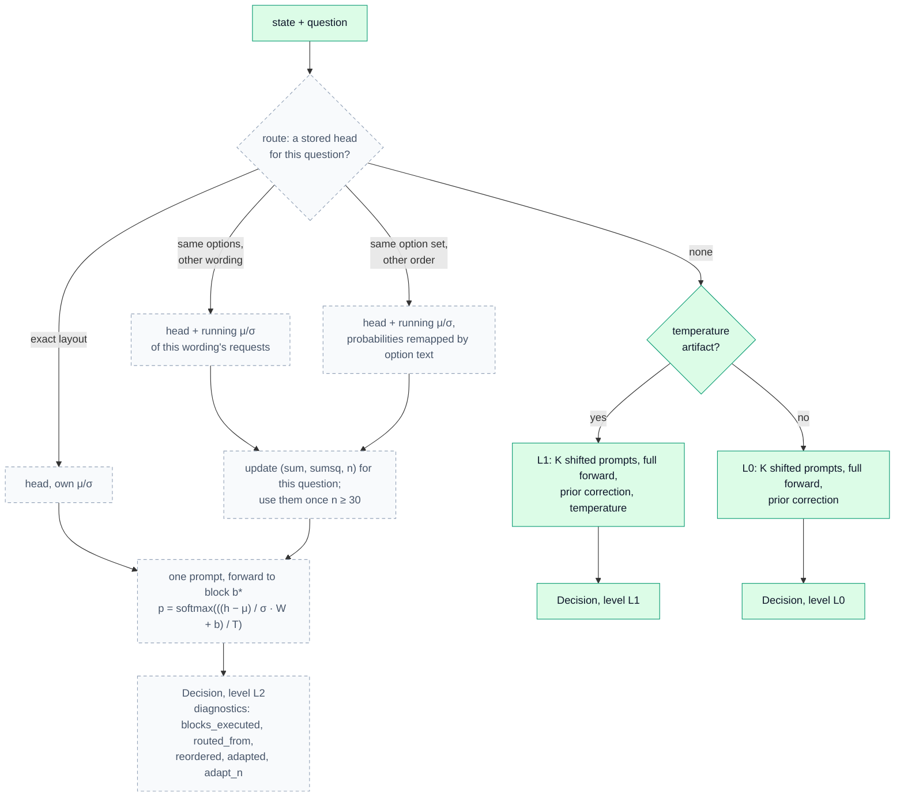
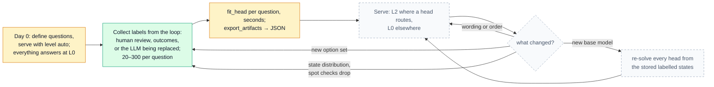

<div align="center">


[](https://pypi.org/project/anyjev/)
[](https://pypi.org/project/anyjev/)
[](https://github.com/nokia-applied-research/AnyJev/actions/workflows/ci.yml)
[](LICENSE)

**English** · [简体中文](README.zh-CN.md) · [🚀 Usage](#-usage) · [📊 Results](#-results) · [🧭 Roadmap](#-roadmap) · [📖 Levels contract](docs/levels.md)

</div>

<p align="center">
  <b>Jiamu Zhang</b><sup>1</sup> &nbsp;&nbsp;&nbsp; <b>Tianze Yang</b><sup>1</sup> &nbsp;&nbsp;&nbsp; <b>Yucheng Shi</b><sup>2</sup> &nbsp;&nbsp;&nbsp; <b>Liang Wu</b><sup>1</sup>
</p>
<p align="center">
  <sub><sup>1</sup>&nbsp;Nokia, Sunnyvale, CA &nbsp;&nbsp;&nbsp;&nbsp; <sup>2</sup>&nbsp;Tencent Hunyuan</sub>
</p>

<p align="center">
  
  <br>
  <sub>Qwen3-8B on a real BANKING77 item. Every number is a model output.</sub>
</p>

> [!TIP]
> **🚧 To be continued:** L2, a closed-form head per question served from one prompt. See the [Roadmap](#-roadmap).

## ✨ What it does

Ask any open LLM a **typed question** and get back a **decision with a probability you can threshold**, read from one prefill of its next-token distribution. No generation, no parsing, no training. Raw logits change their answer when you reorder the options, and their confidence cannot be trusted; AnyJev fixes both without labels.

<div align="center">

| | raw logits | **AnyJev L0** | **AnyJev L1** |
|:--|:--:|:--:|:--:|
| Labels required | none | **none** | 100–500 |
| Answer flips when options are reversed | 0.230 | **0.073** | 0.077 |
| Accuracy | 0.747 | **0.803** | 0.807 |
| Calibration error (ECE) | 0.240 | 0.184 | **0.095** |
| **Auto-decidable at ≤5% error** | **7.7%** | **46.3%** | **52.0%** |

<sub>Qwen3-8B, BANKING77 20-way, 300 test items. Full table incl. every ablation: <a href="docs/results_bench.md">docs/results_bench.md</a></sub>

</div>

The last row is the point. Accuracy moves by 6 points, but the share of traffic you can safely automate goes from **7.7% to 52.0%**, a 6.8× difference on this task (a point estimate at n=300; the interval is wide, see Limitations). With raw logits a "0.9" is not trustworthy enough to act on, so everything goes to a human. Once the probability means what it says, you can set a threshold.

## 🚀 Usage

**📦 1. Install**

```bash
pip install "anyjev[hf]"
```

**💬 2. Ask typed questions.** L0 is on by default and needs no labels.

```python
from anyjev import Decider, Question
from anyjev.backends.hf import HFBackend

d = Decider(HFBackend("Qwen/Qwen3-8B"))

route = Question.choice("Which team should handle this?", ["billing", "technical", "sales", "other"], name="route")
risky = Question.noul("Is this tool call destructive or irreversible?", name="risky")
done  = Question.score("How complete is the task?", bins=5, name="done")

r = d.decide({"conversation": [...], "tool_call": {...}}, [route, risky, done])
r["route"].distribution    # {"billing": 0.81, "technical": 0.07, ...}
r["risky"].p_true          # 0.12
r["done"].value            # 0.35
r.level                    # "L0"
```

**🎯 3. Calibrate when you have labels.** 100–500 labelled states per question give L1.

```python
d.calibrate(risky, states, labels)          # labels are option indices (noul: 0 = Yes)
d.save_artifacts("qwen3-8b.json")           # d.load_artifacts("qwen3-8b.json") next time
r = d.decide(state, [risky], level="L1", require="L1")   # raises rather than fall back to L0
```

**⚡ Serving with vLLM.** Start `vllm serve Qwen/Qwen3-8B --enable-prefix-caching`, then use `Decider(VLLMBackend("http://localhost:8000", "Qwen/Qwen3-8B"))` from `anyjev.backends.vllm`. For many states and one question, `d.decide_batch(states, question)`.

## 🧠 How it works

<p align="center">
  
</p>

| Level | Needs | Does | Does **not** |
|---|---|---|---|
| `raw` | nothing | restricted softmax over label tokens (what the clones do) | anything about bias or calibration |
| `L0` | nothing | removes position bias and label-prior bias | make the model's uncertainty calibrated |
| `L1` | 100 to 500 labels per question | temperature scaling on top of L0 | survive distribution shift beyond the calibration set |

Every `Decision` carries its `level`. L0 costs K prefills for a K-option `choice`, batched over a shared prefix: about 0.25 s per decision at batch 32 on one H100 (K = 20).

## 📊 Results

<table>
<tr>
<td align="center" width="33%" valign="top">
<h3>9 / 9</h3>
<b>🔁 Order flips cut</b><br>
<sub>every model × task row, at L0</sub><br>
<sub><a href="docs/results_bench.md">3 models × 3 tasks →</a></sub>
</td>
<td align="center" width="33%" valign="top">
<h3>0.036</h3>
<b>🎯 ECE on typed-decisions</b><br>
<sub>Qwen3-32B + L1, no training; Jev (published) 0.144. On accuracy, fine-tuned Laya still leads.</sub><br>
<sub><a href="docs/results_typed.md">2,000 decisions →</a></sub>
</td>
<td align="center" width="33%" valign="top">
<h3>0.771</h3>
<b>🧩 Closed-form head accuracy</b><br>
<sub>200 labels per question; raw 0.626</sub><br>
<sub><a href="bench/results_heads">preview →</a></sub>
</td>
</tr>
</table>

<p align="center"><sub>More: <a href="docs/results_latency.md">latency</a> · <a href="demo/games/README.md">2048 and Minesweeper</a> · <a href="docs/results_maze.md">NanoJev maze</a> · <a href="docs/when_l0_helps.md">when L0 helps</a> · <a href="docs/results_small_models.md">small models</a> · <a href="docs/results_bench.md">every ablation</a></sub></p>

<details>
<summary>Closed-form head: numbers and caveats</summary>

| typed-decisions, Qwen3-8B, 200 labels per question, 20 questions × 100 test decisions | acc | ECE | Brier |
|---|---|---|---|
| raw logits | 0.626 | 0.330 | 0.688 |
| AnyJev L0 (permutation) | 0.635 | 0.320 | 0.669 |
| AnyJev L1 (temperature) | 0.626 | 0.174 | 0.482 |
| **closed-form head, chosen per question by cross-validation** | **0.771** | **0.120** | **0.339** |
| laya-typed-decisions, fine-tuned on all 300 train cases per question | 0.768 | 0.215 | — |

Per kind: `choice` 0.60 → 0.75, `noul` 0.71 → 0.85, `score` 0.59 → 0.73; 19 of 20 questions improve. A head fit on one option order is not order-invariant (0.95 of answers flip under reversal; 0.11–0.19 when fit on shift-averaged features, at K prefills), and its labels have to come from the task: heads fit on the model's own answers gain nothing. One model and one seed so far; JSON in `bench/results_heads/`.

</details>

<details>
<summary>All models and tasks in one figure</summary>


</details>

<sub>Every number is regenerated from committed JSON (`bash scripts/regen_docs.sh`); an independent rerun reproduced every zero-label number bit for bit. Not affiliated with TypeSafe AI or Jev; rows marked as published by their authors were not rerun.</sub>

## 🧭 Roadmap

- [x] `choice`, `noul` and `score` from one prefill, nothing generated
- [x] L0 with zero labels; L1 with artifacts saved as JSON; levels enforced with `require=`
- [x] transformers and vLLM backends with shared-prefix scoring
- [x] Closed-form heads fit offline (preview)
- [ ] **L2**: a closed-form head per question served from one prompt, with routing and `level="auto"`
- [ ] A serving guide: labels from the loop, refits, re-solving for a new base model
- [ ] Span readout beyond 26 options, conformal abstention
- [ ] Llama and Gemma rows, a Jev-compatible HTTP server, multimodal state

*🚧 To be continued…* Dated plan in [ROADMAP.md](ROADMAP.md).

<details>
<summary><b>How one decision will work with L2</b> <i>(to be continued)</i></summary>

Green is in `main` today; dashed is to be continued. Until L2 lands, every decision takes the right-hand branch.



</details>

<details>
<summary><b>Deployment lifecycle</b> <i>(to be continued)</i></summary>

Start at L0 with zero labels, let the loop produce labels, fit heads in seconds, re-solve only when the base model changes. Green is in `main`, amber is a preview, dashed is to be continued.



</details>

## 🔍 Limitations

- **Calibration cannot fix a model that cannot answer.** On maze edges and Minesweeper no readout beats the trivial baseline.
- **L0 is not a free win everywhere.** The batch prior costs accuracy when one label dominates; measure on your task ([when L0 helps](docs/when_l0_helps.md)).
- **L1 does not survive distribution shift** beyond its calibration set.

<sub>Also: at most 26 options in the letter readout; L1 reshapes confidence without changing the ranking; coverage at 5% risk is a high-variance estimate at n = 300; the headline tables are Qwen models.</sub>

## 🤝 Contributing and citation

Backends and bench providers are one file each; several are **help wanted** ([CONTRIBUTING.md](CONTRIBUTING.md)). Changes: [CHANGELOG.md](CHANGELOG.md). Credits: [CREDITS.md](CREDITS.md).

```bibtex
@software{anyjev2026,
  title  = {AnyJev: Turn any LLM into a Jev-style decision model},
  author = {Zhang, Jiamu and Yang, Tianze and Shi, Yucheng and Wu, Liang},
  year   = {2026},
  url    = {https://github.com/nokia-applied-research/AnyJev}
}
```

Apache-2.0, see [LICENSE](LICENSE). Datasets keep their own licenses, see [THIRD_PARTY.md](THIRD_PARTY.md).
