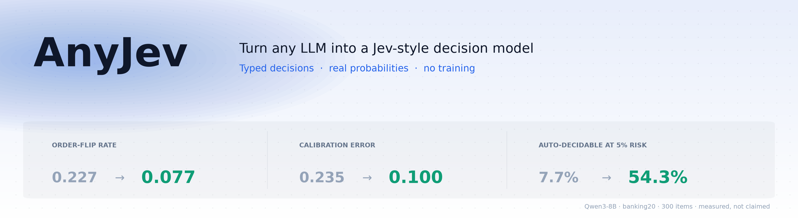

<div align="center">

<picture>
  <source media="(prefers-color-scheme: dark)" srcset="assets/banner-dark.png">
  
</picture>

[](https://pypi.org/project/anyjev/)
[](https://pypi.org/project/anyjev/)
[](https://github.com/nokia-applied-research/AnyJev/actions/workflows/ci.yml)
[](LICENSE)

**English** · [简体中文](README.zh-CN.md) · [Levels contract](docs/levels.md) · [Results](docs/results_bench.md) · [Roadmap](ROADMAP.md)

<sub><b>Jiamu Zhang</b><sup>1</sup> &nbsp;·&nbsp; <b>Tianze Yang</b><sup>1</sup> &nbsp;·&nbsp; <b>Yucheng Shi</b><sup>2</sup> &nbsp;·&nbsp; <b>Liang Wu</b><sup>1</sup><br>
<sup>1</sup>Nokia, Sunnyvale, CA &nbsp;&nbsp; <sup>2</sup>Tencent Hunyuan</sub>

</div>

---


<div align="center">
<sub>Qwen3-8B, a real BANKING77 item, real outputs.</sub><br>
<sub><b>Left:</b> raw next-token readout — reverse the options and the answer flips, at 1.00 confidence.</sub><br>
<sub><b>Right:</b> AnyJev L0, zero labels — same answer both ways.</sub><br>
<sub>Regenerate with <code>scripts/find_flip_example.py</code> and <code>scripts/make_flip_gif.py</code>.</sub>
</div>

---

## What it is

Give it a **state** and a set of **typed questions**. Get back a decision and a probability per question, read straight off the model's next-token distribution — **no generation, no parsing, no fine-tuning**. It works with the model you already have loaded.

```python
r = decider.decide(state, [route, is_destructive, is_done])

r["route"].distribution     # {"billing": 0.81, "technical": 0.07, ...}
r["is_destructive"].p_true  # 0.12
r["is_done"].value          # 0.35
r.level                     # "L0"
```

### Why not just read the logits?

Because `max_tokens=1` plus logprobs gives you a **ranking that moves when you reorder the options**, and a confidence number you **cannot threshold on**. Both are fixable without training, and AnyJev fixes them by default.

<div align="center">

| | raw logits | **AnyJev L0** | **AnyJev L1** |
|:--|:--:|:--:|:--:|
| Labels required | none | **none** | 100–500 |
| Answer flips when options are reversed | 0.227 | **0.077** | 0.077 |
| Accuracy | 0.750 | **0.807** | 0.807 |
| Calibration error (ECE) | 0.235 | 0.180 | **0.100** |
| **Auto-decidable at ≤5% error** | **7.7%** | **47.7%** | **54.3%** |

<sub>Qwen3-8B, BANKING77 20-way, 300 test items. Full table incl. every ablation: <a href="docs/results_bench.md">docs/results_bench.md</a></sub>

</div>

That last row is the point. Accuracy moves by 6 points — but the share of traffic you can safely automate goes from **7.7% to 54.3%**, a 7× difference. With raw logits a "0.9" is not trustworthy enough to act on, so everything goes to a human. Once the probability means what it says, you can set a threshold.

---

## Highlights

- **Training-free debiasing, on by default (L0).** Cyclic-shift marginalization removes option-order bias; a label-free prior estimate removes the model's label bias. Zero labels, zero fine-tuning.
- **Post-hoc calibration when you have labels (L1).** Temperature scaling per (model, question), stored as a small JSON artifact. Loading one fit on a different model is a hard error.
- **Every result declares its level.** `decision.level` is `raw`, `L0`, or `L1`. Downstream code can refuse to act on the wrong one.
- **Three typed primitives.** `choice` (up to 26 options), `noul` (Yes/No with a real `p_true`), `score` (2–10 ordinal bins with an expected value).
- **A two-method backend contract.** A backend returns next-token log-probabilities and nothing else. transformers and vLLM ship today; new ones are a single file.
- **A benchmark that reports calibration,** not just accuracy: Brier, ECE, order-flip rate, and coverage at 5% risk — from one command, regenerated from committed JSON.

> [!NOTE]
> Not affiliated with, endorsed by, or derived from TypeSafe AI or Jev. Every comparison in this README is measured here and reproducible from `bench/`, except rows explicitly marked as published by their authors.

---

## Install

```bash
pip install "anyjev[hf]"        # library + transformers backend
pip install anyjev              # library only (numpy); bring your own backend
```

The benchmark is not in the wheel — it needs the datasets, the results directory, and the other projects' code, so it runs from a checkout:

```bash
git clone https://github.com/nokia-applied-research/AnyJev && cd AnyJev
pip install -e ".[hf,bench,dev]"
```

## Ten lines

```python
from anyjev import Decider, Question
from anyjev.backends.hf import HFBackend

d = Decider(HFBackend("Qwen/Qwen3-8B"))

route = Question.choice("Which handler should process this request?",
                        ["billing", "technical", "sales", "other"], name="route")
safe  = Question.noul("Is the proposed tool call destructive or irreversible?", name="safe")
done  = Question.score("How complete is the task on a 0 to 1 scale?", bins=5, name="done")

state = {"conversation": [...], "proposed_tool_call": {...}}
r = d.decide(state, [route, safe, done])

r["route"].argmax          # "billing"
r["route"].distribution    # {"billing": 0.81, "technical": 0.07, ...}
r["safe"].p_true           # 0.12
r["done"].value            # 0.35
r.level                    # "L0"  (debiased, not calibrated)
```

With labels:

```python
art = d.calibrate(safe, calib_states, calib_labels)   # ~100 to 500 examples -> L1 artifact
r = d.decide(state, [safe], level="L1")
```

---

## Why L0 is not optional

A `noul` question, "Is this email spam?". Raw readout on the email gives **P(Yes) = 0.62**. The same prompt with the email replaced by `N/A` gives **P(Yes) = 0.70** — the model leans Yes regardless of content. Divide by that prior and renormalize, and the answer is **P(Yes) = 0.41**. The judgment flips.

Position bias does the same thing to `choice` questions when you reorder the options. Both are properties of the readout, not of the model's knowledge, and both are fixable without a single label.

## Levels

Full contract in [docs/levels.md](docs/levels.md).

| Level | Needs | Does | Does **not** |
|---|---|---|---|
| `raw` | nothing | restricted softmax over label tokens (what the clones do) | anything about bias or calibration |
| `L0` | nothing | removes position bias and label-prior bias | make the model's uncertainty calibrated |
| `L1` | 100 to 500 labels per question | temperature scaling on top of L0 | survive distribution shift beyond the calibration set |

## Cost

L0 trades compute for stability: a `choice` with K options costs **K prefills** (2 for `noul`, 1 for `score`), all sharing the state prefix and all batchable. Nothing is ever generated, so there is no autoregressive decode in the loop. `max_permutations` caps K.

On one H100, the transformers path at 20 permutations is about **0.25 s per decision at batch 32**. The vLLM path is the fast one and has no published number yet — a latency column is [on the roadmap](ROADMAP.md).

---

## Benchmark

```bash
python -m bench.run --model Qwen/Qwen3-8B --tasks newsgroups,injection,banking20 --n 300 --calib 200
```

Results land in `bench/results/<date>/` as Markdown and JSON with hardware and library versions. `python -m bench.table bench/results/<date>` regenerates the tables below; **nothing is typed in by hand.**


<div align="center">
<sub>Regenerate with <code>python scripts/make_results_figure.py</code> — it reads the same committed JSON as <code>bench.table</code>.</sub>
</div>

### Reorder the options and one in five answers changes

Three open models, three tasks, 300 test items each. `flip` is the fraction of items whose answer changes when the option list is reversed (`choice`) or the Yes/No phrasing order is swapped (`noul`).

| model | task | K | raw flip | L0 flip | raw acc | L0 acc | raw ECE | L1 ECE |
|---|---|---|---|---|---|---|---|---|
| Qwen3-8B | banking20 | 20 | 0.227 | **0.077** | 0.750 | **0.807** | 0.235 | **0.100** |
| Qwen3-8B | newsgroups | 20 | 0.237 | **0.173** | 0.640 | **0.660** | 0.331 | **0.157** |
| Qwen3-8B | injection | 2 | 0.060 | **0.000** | 0.693 | **0.710** | 0.287 | **0.162** |
| Qwen2.5-7B-Instruct | banking20 | 20 | 0.197 | **0.067** | 0.723 | **0.767** | 0.236 | **0.072** |
| Qwen2.5-7B-Instruct | newsgroups | 20 | 0.233 | **0.123** | 0.660 | **0.707** | 0.276 | **0.082** |
| Qwen2.5-7B-Instruct | injection | 2 | 0.053 | **0.000** | 0.737 | **0.813** | 0.189 | **0.037** |
| Qwen3-30B-A3B-Instruct-2507 | banking20 | 20 | 0.143 | **0.097** | 0.733 | **0.767** | 0.246 | **0.079** |
| Qwen3-30B-A3B-Instruct-2507 | newsgroups | 20 | 0.133 | **0.100** | 0.730 | **0.740** | 0.249 | **0.086** |
| Qwen3-30B-A3B-Instruct-2507 | injection | 2 | 0.093 | **0.000** | 0.723 | **0.767** | 0.253 | **0.080** |

Full table with every ablation row (permutation only, each prior alone, Brier, coverage at 5% risk): [docs/results_bench.md](docs/results_bench.md). One H100, bf16, transformers 4.55.4; regenerate with `python -m bench.table bench/results_batchprior_v0/2026-09-20`.

### On Laya's own benchmark, zero-shot

| system | acc | soft_acc | ece | brier_mean | score_mae |
|---|---|---|---|---|---|
| laya-multilingual (zero-shot), measured here | 0.340 | 0.325 | 0.287 | 0.269 | 0.688 |
| laya (zero-shot), measured here | 0.359 | 0.331 | 0.177 | 0.227 | 0.694 |
| Qwen2.5-7B-Instruct + raw logits (clone baseline) | 0.621 | 0.514 | 0.287 | 0.209 | 0.437 |
| Qwen3-8B + raw logits (clone baseline) | 0.626 | 0.520 | 0.328 | 0.210 | 0.621 |
| Qwen2.5-7B-Instruct + AnyJev L0, zero-shot | 0.628 | 0.506 | 0.200 | 0.176 | 0.451 |
| Qwen2.5-7B-Instruct + AnyJev L1, temperature from 200 train cases | 0.632 | 0.452 | 0.047 | 0.149 | 0.443 |
| Qwen3-8B + AnyJev L0, zero-shot | 0.640 | 0.523 | 0.273 | 0.196 | 0.617 |
| Qwen3-8B + AnyJev L1, temperature from 200 train cases | 0.646 | 0.457 | 0.056 | 0.143 | 0.474 |
| Qwen3-32B + raw logits (clone baseline) | 0.684 | 0.556 | 0.206 | 0.144 | 0.488 |
| Qwen3-32B + AnyJev L0, zero-shot | 0.700 | 0.548 | 0.133 | 0.128 | 0.456 |
| Qwen3-32B + AnyJev L1, temperature from 200 train cases | 0.701 | 0.502 | **0.034** | 0.120 | 0.412 |
| Jev 1.13.0 (published by TypeSafe / Laya; not rerun) | 0.727 | 0.580 | 0.144 | 0.148 | 0.391 |
| laya-typed-decisions (fine-tuned on this set's train split), measured here | **0.768** | 0.471 | 0.215 | **0.118** | **0.243** |

All rows except Jev were measured here on the same 2,000 decisions; the fine-tuned Laya checkpoint reproduces its published 0.766. **Read it two ways.** On argmax accuracy the fine-tuned Laya wins, and a zero-training 32B open model lands 2.7 points behind Jev. On the probabilities — what a System One model is for — the fine-tuned Laya's ECE (0.215) is **six times** AnyJev L1's (0.034), though it stays narrowly ahead on Brier, 0.118 against 0.120. Temperature scaling trades soft accuracy for calibration, so the 7B and 8B L1 rows drop to about 0.45 there. Laya's zero-shot checkpoints, the ones you would use on a question they were not trained for, score 0.34 to 0.36 against a 0.32 random baseline.

Per-workflow and per-type breakdown: [docs/results_typed.md](docs/results_typed.md); regenerate with `python -m bench.run_typed --model <model>` and `python -m bench.providers.laya`.

### Inside NanoJev's maze harness

| engine | goal test | goal ood | attempts | collisions | edge acc | majority | edge Brier | edge questions |
|---|---|---|---|---|---|---|---|---|
| Qwen3-0.6B + AnyJev L0 (batch prior) | 10/11 | 3/4 | 15616 | 6236 | 0.490 | 0.618 | 0.271 | 23156 |
| Qwen3-0.6B + AnyJev L0 (content_free prior) | 10/11 | 4/4 | 16278 | 6563 | 0.490 | 0.614 | 0.274 | 23284 |
| Qwen3-0.6B + AnyJev L0 (none prior) | 10/11 | 3/4 | 21851 | 9136 | 0.403 | 0.597 | 0.460 | 28040 |
| Qwen3-0.6B + AnyJev raw | 11/11 | 4/4 | 5825 | 2616 | 0.537 | 0.539 | 0.363 | 10944 |
| Qwen3-8B + AnyJev L0 (batch prior) | 11/11 | 3/4 | 17841 | 7171 | 0.555 | 0.600 | 0.344 | 25124 |
| Qwen3-0.6B native A/B readout (NanoJev's 'Untuned Qwen' protocol) | 10/11 | 3/4 | 20555 | 8496 | 0.419 | 0.607 | 0.305 | 27660 |

NanoJev compares its trained 0.6B model against an "Untuned Qwen3-0.6B" that reads A/B logits for four Boolean questions per maze cell. We reimplemented that readout and swapped only the Boolean engine inside their frozen scaled_maze pipeline ([docs/SCALED_GAMES.md](https://github.com/TianyuCodings/NanoJev/blob/main/docs/SCALED_GAMES.md)), on their 15 test and out-of-distribution episodes. This is **not** the evaluation behind the 2/10 figure in their held-out gameplay table, which comes from a separate 274-case suite we did not run.

**Two things are true at once.** The untuned readout's score depends heavily on how you read it: the same Qwen3-0.6B goes from 13/15 mazes and 20,555 attempts under the A/B readout to 15/15 and 5,825 under AnyJev's raw Yes/No readout. And no readout, not even Qwen3-8B, beats always answering the majority label on "is one step north clear?" (edge accuracy 0.40 to 0.56 against a 0.54 to 0.62 majority). We report it because it is the comparison NanoJev invites; we do not headline it. Full table: [docs/results_maze.md](docs/results_maze.md).

---

## Limitations

We would rather you find these here than in production.

- **L0 is not a free win on every task.** On Qwen3-8B's prompt-injection split, L0's coverage at 5% risk (0.160) lands *below* raw (0.297). The content-free prior swings hardest of all: +8 to +12 points on one `noul` task, −3 on ordinal scores, −9 on another model's `noul`. Measure on your task; the bench prints every ablation from the same forward passes, so it costs nothing extra.
- **The batch prior needs a batch.** It activates only after `min_prior_n` (default 8) items of the same question, and it assumes the batch's label marginal is not extreme. It over-corrects when the marginal is skewed — a shrinkage knob is an open research item on the roadmap.
- **Calibration cannot fix a model that cannot answer.** In the maze harness, no readout beats the majority-class baseline on edge perception. AnyJev makes uncertainty *legible*, not smaller.
- **26 options max** in the current letter readout. Span readout lifts the cap; it is the next item on the roadmap.
- **L1 does not survive distribution shift** beyond its calibration set, and it reshapes confidence without changing the ranking.
- **One model family in the tables so far.** Everything above is Qwen. Llama and Gemma rows are on the roadmap.

## Status

**v0.0.2.** The library, both backends, and all three benches are real and measured; every table is regenerated from committed JSON. Actively developed — the plan with dates is in [ROADMAP.md](ROADMAP.md).

**Next up:** span readout beyond 26 options, conformal abstention, a latency column, a live demo, Llama and Gemma rows. **After that:** a Jev-compatible HTTP server, more backends, and multimodal state.

Backends and bench providers are one file each and several are marked **help wanted** — see [CONTRIBUTING.md](CONTRIBUTING.md). What landed: [CHANGELOG.md](CHANGELOG.md). Who we build on: [CREDITS.md](CREDITS.md).

## Citation

```bibtex
@software{anyjev2026,
  title  = {AnyJev: Turn any LLM into a Jev-style decision model},
  author = {Zhang, Jiamu and Yang, Tianze and Shi, Yucheng and Wu, Liang},
  year   = {2026},
  url    = {https://github.com/nokia-applied-research/AnyJev}
}
```

## License

Apache-2.0 — see [LICENSE](LICENSE). Datasets keep their own licenses, see [THIRD_PARTY.md](THIRD_PARTY.md).
