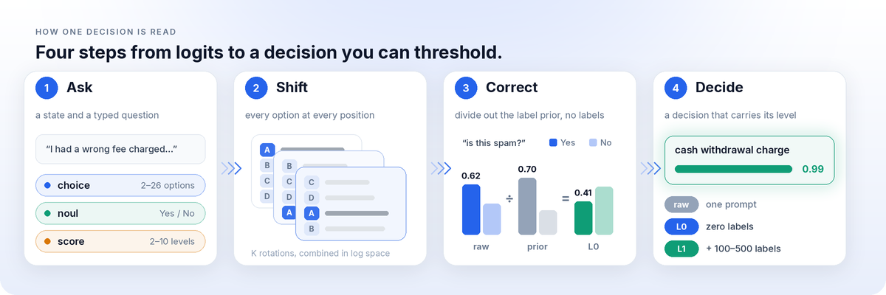
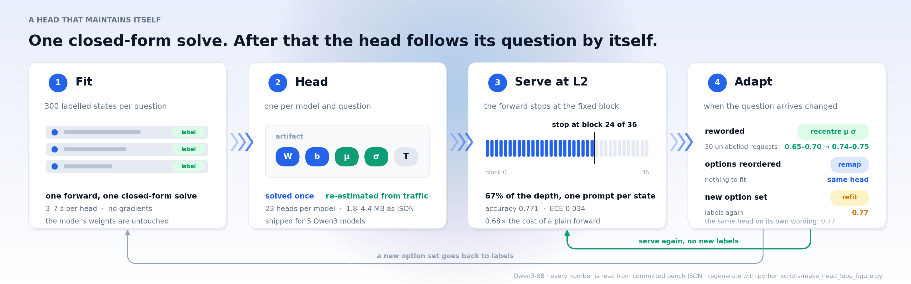
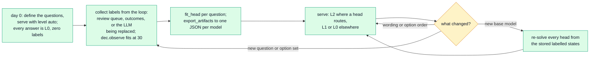

<div align="center">


[](https://pypi.org/project/anyjev/)
[](https://pypi.org/project/anyjev/)
[](https://github.com/nokia-applied-research/AnyJev/actions/workflows/ci.yml)
[](LICENSE)

**English** · [简体中文](README.zh-CN.md) · [🚀 Usage](#-usage) · [📊 Results](#-results) · [🧭 Roadmap](#-roadmap) · [📖 Levels contract](docs/levels.md)

</div>

<p align="center">
  <b>Jiamu Zhang</b><sup>1</sup> &nbsp;&nbsp;&nbsp; <b>Tianze Yang</b><sup>1</sup> &nbsp;&nbsp;&nbsp; <b>Yucheng Shi</b><sup>2</sup> &nbsp;&nbsp;&nbsp; <b>Liang Wu</b><sup>1</sup>
</p>
<p align="center">
  <sub><sup>1</sup>&nbsp;Nokia, Sunnyvale, CA &nbsp;&nbsp;&nbsp;&nbsp; <sup>2</sup>&nbsp;Tencent Hunyuan</sub>
</p>

<p align="center">
  
  <br>
  <sub>Qwen3-8B on a real BANKING77 item. Every number is a model output.</sub>
</p>

> [!TIP]
> **🆕 L2 has landed.** A closed-form head per question, solved on 100–300 labels in seconds, served from **one prompt stopped at two thirds of the model's depth**. It follows its question across rewordings without new labels. [Jump to it ↓](#-a-head-that-maintains-itself)

## ✨ What it does

Ask any open LLM a **typed question** and get back a **decision with a probability you can threshold**, read from one prefill of its next-token distribution. No generation, no parsing, no fine-tuning. Raw logits change their answer when you reorder the options, and their confidence cannot be trusted; AnyJev fixes the first with zero labels and the second with a few hundred.

<div align="center">

| | raw logits | **AnyJev L0** | **AnyJev L1** |
|:--|:--:|:--:|:--:|
| Labels required | none | **none** | 100–500 |
| Answer flips when options are reversed | 0.230 | **0.073** | 0.077 |
| Accuracy | 0.747 | **0.803** | 0.807 |
| Calibration error (ECE) | 0.240 | 0.184 | **0.095** |
| **Auto-decidable at ≤5% error** | **7.7%** | **46.3%** | **52.0%** |

<sub>Qwen3-8B, BANKING77 20-way, 300 test items. Full table incl. every ablation: <a href="docs/results_bench.md">docs/results_bench.md</a></sub>

</div>

The last row is the point. Accuracy moves by 6 points, but the share of traffic you can safely automate goes from **7.7% to 52.0%**, a 6.8× difference on this task (a point estimate at n=300; the interval is wide, see Limitations). With raw logits a "0.9" is not trustworthy enough to act on, so everything goes to a human. Once the probability means what it says, you can set a threshold.

## 🚀 Usage

**📦 1. Install**

```bash
pip install "anyjev[hf]"
```

**💬 2. Ask typed questions.** L0 is on by default and needs no labels.

```python
from anyjev import Decider, Question
from anyjev.backends.hf import HFBackend

d = Decider(HFBackend("Qwen/Qwen3-8B"))

route = Question.choice("Which team should handle this?", ["billing", "technical", "sales", "other"], name="route")
risky = Question.noul("Is this tool call destructive or irreversible?", name="risky")
done  = Question.score("How complete is the task?", bins=5, name="done")

r = d.decide({"conversation": [...], "tool_call": {...}}, [route, risky, done])
r["route"].distribution    # {"billing": 0.81, "technical": 0.07, ...}
r["risky"].p_true          # 0.12
r["done"].value            # 0.35
r.level                    # "L0"
```

**🎯 3. Add labels when you have them.** A temperature is L1; a closed-form head is **L2**, the accurate one.

```python
d.calibrate(risky, states, labels)          # 100–500 labels → L1 (a temperature)
d.fit_head(route, states, labels)           # 100–300 labels → L2, one forward + a closed-form solve, seconds
d.save_artifacts("qwen3-8b.json")           # d.load_artifacts(...) next time; ~100 KB per head

r = d.decide(state, [route], level="auto")  # L2 where a head routes, else L1, else L0
r["route"].level                            # "L2"
```

**🔁 4. Or let the loop feed it.** `d.observe(route, state, label)` stores labels as they arrive and solves the head by itself at 30, re-solving at 60, 120, …

**⚡ Serving.** The transformers backend (`anyjev.backends.hf`) serves every level today; serving through vLLM / SGLang is on the [roadmap](#-roadmap), not in this release. For many states and one question, `d.decide_batch(states, question)`.

**🎬 Try it in one command.** `python -m demo.jev_mode --backend fake` runs the whole thing on a synthetic model in under a second, no download. `--lifecycle` plays the deployment loop; drop `--backend fake` to run a real Qwen3 with the shipped heads ([demo](demo/)).

## 🧠 How it works

<p align="center">
  
</p>

| Level | Needs | Does | Does **not** |
|---|---|---|---|
| `raw` | nothing | restricted softmax over label tokens (what the clones do) | anything about bias or calibration |
| `L0` | nothing | averages position bias out over the K rotations and divides out the label prior | make the model's uncertainty calibrated |
| `L1` | 100–500 labels per question | temperature scaling on top of L0 | change the ranking |
| **`L2`** | **100–300 labels per question, a local model** | **a closed-form head (shrunk LDA / ridge) on the hidden state at ~⅔ depth, one prompt per state** | **transfer to another question or model** |

Every `Decision` carries its `level`, so downstream code can refuse to act on the wrong one. L0 costs K prefills for a K-option `choice` (about 0.25 s per decision at batch 32 on one H100, K = 20); **L2 costs less than one plain forward** — one prompt, stopped early: 0.68× on Qwen3-8B.

## <a id="-a-head-that-maintains-itself"></a>🔁 A head that maintains itself

L2 is not a training run. Labels buy a head in **one closed-form solve** (seconds on a CPU, no gradients, the model's weights untouched). After that only the head's feature mean and scale move, re-estimated from **unlabelled** traffic — so the head follows its question across rewordings and option orders by itself, and new labels are needed only for a new question.

<p align="center">
  
</p>

Reworded, the Qwen3-8B head as is drops from 0.77 to 0.65–0.70; **30 unlabelled requests** of the new wording bring it back to 0.74–0.75, against 0.77 for a fully relabelled refit ([JSON](bench/results_paraphrase/2026-09-22/)).

**One decision at serving time.** A stored head answers from one truncated forward. Without one, the same call falls back to L1 or L0 exactly as before; the routing is in [docs/method_v3.md](docs/method_v3.md).

<p align="center">
  
</p>

**Deployment lifecycle: day 0 at L0, labels from the loop, heads in seconds**



A shift in the *states* (not the wording) is invisible to the recentring, so a periodic spot check on a labelled slice stays in the recipe. Full method: [docs/method_v3.md](docs/method_v3.md).


## 📊 Results

<table>
<tr>
<td align="center" width="33%" valign="top">
<h3>9 / 9</h3>
<b>🔁 Order flips cut</b><br>
<sub>every model × task row, at L0, zero labels</sub><br>
<sub><a href="docs/results_bench.md">3 models × 3 tasks →</a></sub>
</td>
<td align="center" width="33%" valign="top">
<h3>0.80</h3>
<b>🧩 Typed-decisions accuracy</b><br>
<sub>Qwen3-32B and 30B-A3B at L2, 300 labels per question; Jev 0.727 as published, fine-tuned Laya 0.768</sub><br>
<sub><a href="docs/results_exit.md">5 models →</a></sub>
</td>
<td align="center" width="33%" valign="top">
<h3>0.68×</h3>
<b>⚡ Cost of one decision</b><br>
<sub>of a single plain forward, Qwen3-8B at L2: one prompt, stopped at block 24 of 36</sub><br>
<sub><a href="docs/results_latency.md">latency →</a></sub>
</td>
</tr>
</table>

**Jev mode**, on LocalLLaMA/typed-decisions (20 questions, 300 labels each, 2,000 held-out decisions):

<div align="center">

| model | L0, zero labels | **L2** | block | cost vs one forward |
|:--|:--:|:--:|:--:|:--:|
| Qwen3-1.7B | 0.494 | **0.730** | 18 / 28 | 0.70× |
| Qwen3-4B | 0.564 | **0.786** | 24 / 36 | 0.69× |
| Qwen3-8B | 0.647 | **0.771** | 24 / 36 | 0.68× |
| Qwen3-30B-A3B | 0.630 | **0.799** | 40 / 48 | not measured |
| Qwen3-32B | 0.700 | **0.798** | 52 / 64 | 0.84× |

<sub>Pooled ECE at L2 is 0.03–0.05. Jev 0.727 and fine-tuned Laya 0.768 on the same set, as published by their authors. Every cell: <a href="docs/results_exit.md">docs/results_exit.md</a></sub>

</div>

A 1.7B at 64% of its depth reaches the number Jev publishes; a 4B ties the fine-tuned 421M Laya. **100 labels** already put the 8B head at 0.740 (20 labels: 0.654, 300: 0.772).

<p align="center"><sub>More: <a href="docs/jev_mode.md">Jev mode in full</a> · <a href="demo/games/README.md">2048 and Minesweeper</a> · <a href="docs/results_maze.md">NanoJev maze</a> · <a href="docs/when_l0_helps.md">when L0 helps</a> · <a href="docs/results_small_models.md">small models</a> · <a href="docs/research_log.md">the research log, negative results included</a></sub></p>

<details>
<summary>Heads you can load today, and what a head costs</summary>

`anyjev-heads/<model>.json` ships 23 heads per model (the 20 typed-decisions questions and three bench tasks) for Qwen3-1.7B / 4B / 8B / 30B-A3B / 32B, built and validated through the same `fit_head` → `decide_batch` path a user runs (`scripts/build_heads.py`). A head is a `[hidden, K]` matrix plus a bias, a standardisation vector and a temperature: ~100 KB, solved in 2–8 s on the 1.7B–8B.

The big model's heads also distil into a small one without gradients: the 32B's heads labelling 1,200 generated cases per workflow lift the 1.7B from 0.730 to 0.760 (the 4B and 8B do not move). [docs/jev_mode.md](docs/jev_mode.md)

</details>

<details>
<summary>All models and tasks in one figure</summary>


</details>

<sub>Every number is regenerated from committed JSON (`bash scripts/regen_docs.sh`); a second run from a clean checkout reproduced every zero-label number bit for bit. Not affiliated with TypeSafe AI or Jev; rows published by their authors were not rerun here.</sub>

## 🧭 Roadmap

- [x] `choice`, `noul` and `score` from one prefill, nothing generated
- [x] L0 with zero labels; L1 artifacts as JSON; levels enforced with `require=`
- [x] **L2**: a closed-form head per question, routing, label-free adaptation, `level="auto"`, `observe`
- [x] Shipped heads for five Qwen3 models; a packaged demo (`python -m demo.jev_mode`)
- [ ] **L2 on served engines** (vLLM / SGLang): the residual stream at one block, or a truncated checkpoint
- [ ] **Agent-loop evaluation**: the same decisions inside a real agent, against the LLM they replace
- [ ] Heads on the Hugging Face Hub, an interactive Space, a technical report
- [ ] More models (Llama, Gemma, Mistral, DeepSeek), span readout beyond 26 options, conformal abstention

Dated plan and help-wanted files: [ROADMAP.md](ROADMAP.md).

## 🔍 Limitations

- **On typed-decisions, "accuracy" is agreement with a teacher LLM.** The gold is the mean of three samples of one model; a fresh sample of that teacher agrees with it 0.735 of the time.
- **L2 is per question and per model.** Heads fit on other questions do not help a new one, and only Qwen3 heads ship. It also needs hidden states: transformers today; vLLM / SGLang are on the roadmap.
- **Calibration cannot fix a model that cannot answer.** On maze edges and Minesweeper no readout beats the trivial baseline.
- **L0 is not a free win everywhere.** The batch prior costs accuracy when one label dominates ([when L0 helps](docs/when_l0_helps.md)).

<sub>Also: at most 26 options in the letter readout (a span readout is on the roadmap, not in the code); coverage at 5% risk is a high-variance estimate at n = 300; the headline tables are Qwen models; every decision here is scored in isolation, not inside an agent loop.</sub>

## 🤝 Contributing and citation

Backends and bench providers are one file each; several are **help wanted** ([ROADMAP.md](ROADMAP.md), [CONTRIBUTING.md](CONTRIBUTING.md)). Changes: [CHANGELOG.md](CHANGELOG.md). Credits: [CREDITS.md](CREDITS.md).

```bibtex
@software{anyjev2026,
  title  = {AnyJev: Turn any LLM into a Jev-style decision model},
  author = {Zhang, Jiamu and Yang, Tianze and Shi, Yucheng and Wu, Liang},
  year   = {2026},
  url    = {https://github.com/nokia-applied-research/AnyJev}
}
```

Apache-2.0, see [LICENSE](LICENSE). Datasets keep their own licenses, see [THIRD_PARTY.md](THIRD_PARTY.md).
