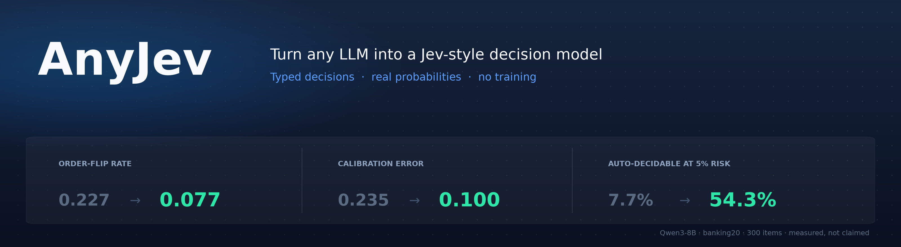
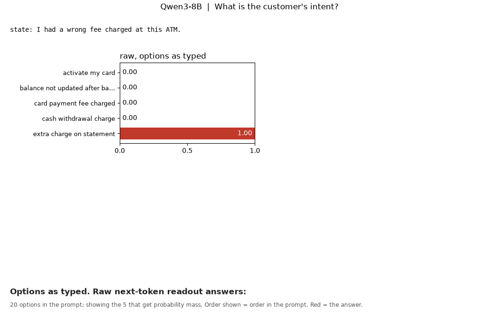
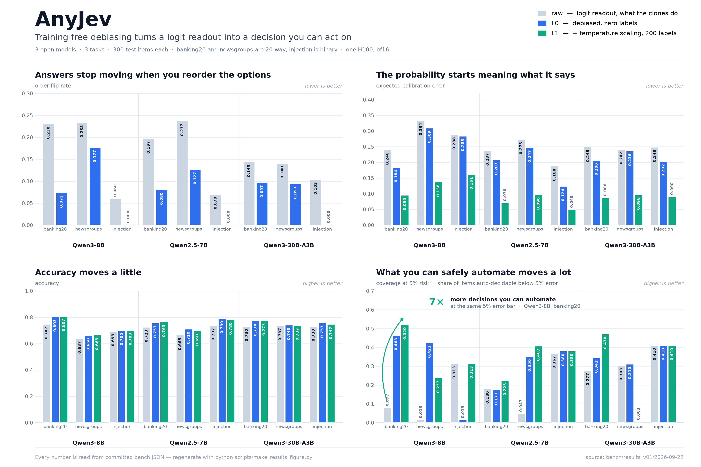

<div align="center">



[](https://pypi.org/project/anyjev/)
[](https://pypi.org/project/anyjev/)
[](https://github.com/nokia-applied-research/AnyJev/actions/workflows/ci.yml)
[](LICENSE)

[English](README.md) · **简体中文** · [档位约定](docs/levels.md) · [完整结果](docs/results_bench.md) · [路线图](ROADMAP.md)

</div>

<p align="center">
  <b>Jiamu Zhang</b><sup>1</sup> &nbsp;&nbsp;&nbsp; <b>Tianze Yang</b><sup>1</sup> &nbsp;&nbsp;&nbsp; <b>Yucheng Shi</b><sup>2</sup> &nbsp;&nbsp;&nbsp; <b>Liang Wu</b><sup>1</sup>
</p>
<p align="center">
  <sub><sup>1</sup>&nbsp;Nokia, Sunnyvale, CA &nbsp;&nbsp;&nbsp;&nbsp; <sup>2</sup>&nbsp;Tencent Hunyuan</sub>
</p>

---



<div align="center">
<sub>Qwen3-8B，一条真实的 BANKING77 样本，真实输出。</sub><br>
<sub><b>左：</b>直接读 next-token logits —— 把选项倒过来，答案就翻了，置信度还是 1.00。</sub><br>
<sub><b>右：</b>AnyJev L0，零标签 —— 两种顺序同一个答案。</sub>
</div>

---

## 为什么不直接读 logits

给 AnyJev 一个 **state** 和一组**类型化的问题**，每个问题返回一个决策和一个概率，直接从模型的 next-token 分布上读出来 —— 不生成 token、不用解析、不用微调，用的就是你已经在跑的那个模型。

这些你自己用 `max_tokens=1` 加 logprobs 也能做。问题在于你拿到的是什么：一个**换个选项顺序就会变的排序**，和一个**没法拿来设阈值的置信度**。这两件事都是**读法**的性质，不是模型知识的性质，而且一条标签都不用就能修。

<div align="center">

| | 直接读 logits | **AnyJev L0** | **AnyJev L1** |
|:--|:--:|:--:|:--:|
| 需要标签 | 无 | **无** | 100–500 条 |
| 选项倒序后答案改变的比例 | 0.227 | **0.077** | 0.077 |
| 准确率 | 0.750 | **0.807** | 0.807 |
| 校准误差（ECE） | 0.235 | 0.180 | **0.100** |
| **错误率 ≤5% 时可自动决策的比例** | **7.7%** | **47.7%** | **54.3%** |

<sub>Qwen3-8B，BANKING77 20 分类，300 条测试样本。含全部消融行的完整表：<a href="docs/results_bench.md">docs/results_bench.md</a></sub>

</div>

最后一行才是重点。准确率只动了 6 个点，但可以安全自动化的流量从 **7.7% 涨到 54.3%**，相差 7 倍。直接读 logits 时那个 "0.9" 不足以支撑你去行动，于是所有请求都得转人工；一旦概率真的表示它字面的意思，你才能设阈值。

> [!NOTE]
> 与 TypeSafe AI 及 Jev 无关，未获其认可，也不派生自它们。本文档中的每一项对比都是我们实测的、可从 `bench/` 复现，明确标注为"由原作者发布"的行除外。

## 快速开始

```bash
pip install "anyjev[hf]"        # 库 + transformers 后端
pip install anyjev              # 只装库（仅依赖 numpy），后端自备
```

```python
from anyjev import Decider, Question
from anyjev.backends.hf import HFBackend

d = Decider(HFBackend("Qwen/Qwen3-8B"))

route = Question.choice("这个请求应该交给哪个处理器？",
                        ["billing", "technical", "sales", "other"], name="route")
safe  = Question.noul("这个工具调用是否具有破坏性或不可逆？", name="safe")
done  = Question.score("任务完成度在 0 到 1 之间是多少？", bins=5, name="done")

state = {"conversation": [...], "proposed_tool_call": {...}}
r = d.decide(state, [route, safe, done])

r["route"].argmax          # "billing"
r["route"].distribution    # {"billing": 0.81, "technical": 0.07, ...}
r["safe"].p_true           # 0.12
r["done"].value            # 0.35
r.level                    # "L0"（已去偏，未校准）

art = d.calibrate(safe, calib_states, calib_labels)   # 100-500 条样本 -> L1 artifact
r = d.decide(state, [safe], level="L1")
```

**State 里放图片。** 问题类型、级别都不变，换成视觉语言后端即可（`pip install "anyjev[vlm]"`，Qwen3-VL 需要 transformers ≥ 4.57）：

```python
from anyjev import Decider, Image, Question
from anyjev.backends.hf_vlm import VLMBackend

d = Decider(VLMBackend("Qwen/Qwen3-VL-2B-Instruct"))

page = Question.choice("What is the user's screen showing?",
                       ["a login form", "a payment page", "an error message", "something else"], name="page")
stuck = Question.noul("Is the user blocked from continuing?", name="stuck")

state = {"screenshot": Image("screenshot.png"), "note": "user says the app is stuck"}
r = d.decide(state, [page, stuck])

r["page"].distribution     # {"an error message": 0.99..., ...}
r["stuck"].p_true
r.level                    # "L0"
```

`Image` 接受路径、URL、bytes 或 PIL 图片，可以放在 state 的任何位置。位置去偏原样适用；是否使用 content-free 先验要看任务，契约和注意事项见 [docs/multimodal.md](docs/multimodal.md)。

Benchmark 不在 wheel 里 —— 它需要数据集、结果目录和其他项目的代码，所以要从仓库里跑：

```bash
git clone https://github.com/nokia-applied-research/AnyJev && cd AnyJev
pip install -e ".[hf,bench,dev]"
```

## 工作原理

三个类型化原语：`choice`（最多 26 个选项）、`noul`（Yes/No，给出真实的 `p_true`）、`score`（2–10 个有序 bin，给出期望值）。后端只做一件事 —— 返回 next-token 的 log 概率 —— 所以新增一个后端就是一个文件；transformers 和 vLLM 已经可用。

后端之上就是让数字变得可用的两项修正。**循环移位边际化**把 K 个选项的列表转 K 次，让每个选项在每个位置各坐一遍，在 log 空间合并。**先验校正**在没有标签的情况下估出模型的标签先验再除掉：一个问"这封邮件是垃圾邮件吗"的 `noul` 读出 P(Yes) = 0.62，把正文换成 `N/A` 后读出 P(Yes) = 0.70 —— 不管内容是什么它都偏向 Yes —— 除以这个先验后得到 0.41，判断翻转。

完整约定见 [docs/levels.md](docs/levels.md)。

| 档位 | 需要什么 | 做什么 | **不**做什么 |
|---|---|---|---|
| `raw` | 无 | 在标签 token 上做受限 softmax（各个克隆项目的做法） | 任何关于偏差或校准的事 |
| `L0` | 无 | 消除位置偏差和标签先验偏差 | 让模型自身的不确定性变得校准 |
| `L1` | 每个问题 100 到 500 条标签 | 在 L0 之上做温度缩放 | 在校准集之外的分布偏移下仍然可靠 |

每个 `Decision` 都带着自己的 `level`，下游代码可以拒绝使用不够格的概率。

**开销。** L0 用算力换稳定性：K 个选项的 `choice` 需要 K 次 prefill（`noul` 2 次，`score` 1 次），它们共享 state 前缀、都能 batch 掉，而且全程不生成任何 token。在一张 H100 上，transformers 路径在 20 个排列时约为**每个决策 0.25 秒（batch 32）**。`max_permutations` 可以给 K 封顶。

---

## Benchmark

```bash
python -m bench.run --model Qwen/Qwen3-8B --tasks newsgroups,injection,banking20 --n 300 --calib 200
```

结果以 Markdown 和 JSON 落在 `bench/results/<日期>/`，带硬件和库版本。下面每一张表和图都由这些 JSON 重新生成；**没有任何数字是手打的。**



### 把选项顺序倒过来，五分之一的答案会变

`flip` 是选项列表倒序（`choice`）或 Yes/No 措辞顺序互换（`noul`）时答案发生变化的样本比例。三个开源模型、三个任务、每个任务 300 条测试样本。

| model | task | K | raw flip | L0 flip | raw acc | L0 acc | raw ECE | L1 ECE |
|---|---|---|---|---|---|---|---|---|
| Qwen3-8B | banking20 | 20 | 0.227 | **0.077** | 0.750 | **0.807** | 0.235 | **0.100** |
| Qwen3-8B | newsgroups | 20 | 0.237 | **0.173** | 0.640 | **0.660** | 0.331 | **0.157** |
| Qwen3-8B | injection | 2 | 0.060 | **0.000** | 0.693 | **0.710** | 0.287 | **0.162** |
| Qwen2.5-7B-Instruct | banking20 | 20 | 0.197 | **0.067** | 0.723 | **0.767** | 0.236 | **0.072** |
| Qwen2.5-7B-Instruct | newsgroups | 20 | 0.233 | **0.123** | 0.660 | **0.707** | 0.276 | **0.082** |
| Qwen2.5-7B-Instruct | injection | 2 | 0.053 | **0.000** | 0.737 | **0.813** | 0.189 | **0.037** |
| Qwen3-30B-A3B-Instruct-2507 | banking20 | 20 | 0.143 | **0.097** | 0.733 | **0.767** | 0.246 | **0.079** |
| Qwen3-30B-A3B-Instruct-2507 | newsgroups | 20 | 0.133 | **0.100** | 0.730 | **0.740** | 0.249 | **0.086** |
| Qwen3-30B-A3B-Instruct-2507 | injection | 2 | 0.093 | **0.000** | 0.723 | **0.767** | 0.253 | **0.080** |

全部消融行（只做排列、单独使用每种先验、Brier、5% 风险下的覆盖率）：[docs/results_bench.md](docs/results_bench.md)。一张 H100，bf16，transformers 4.55.4。

### 在 Laya 自己的 benchmark 上，零样本

| system | acc | soft_acc | ece | brier_mean | score_mae |
|---|---|---|---|---|---|
| laya-multilingual (zero-shot), measured here | 0.340 | 0.325 | 0.287 | 0.269 | 0.688 |
| laya (zero-shot), measured here | 0.359 | 0.331 | 0.177 | 0.227 | 0.694 |
| Qwen2.5-7B-Instruct + raw logits (clone baseline) | 0.621 | 0.514 | 0.287 | 0.209 | 0.437 |
| Qwen3-8B + raw logits (clone baseline) | 0.626 | 0.520 | 0.328 | 0.210 | 0.621 |
| Qwen2.5-7B-Instruct + AnyJev L0, zero-shot | 0.628 | 0.506 | 0.200 | 0.176 | 0.451 |
| Qwen2.5-7B-Instruct + AnyJev L1, temperature from 200 train cases | 0.632 | 0.452 | 0.047 | 0.149 | 0.443 |
| Qwen3-8B + AnyJev L0, zero-shot | 0.640 | 0.523 | 0.273 | 0.196 | 0.617 |
| Qwen3-8B + AnyJev L1, temperature from 200 train cases | 0.646 | 0.457 | 0.056 | 0.143 | 0.474 |
| Qwen3-32B + raw logits (clone baseline) | 0.684 | 0.556 | 0.206 | 0.144 | 0.488 |
| Qwen3-32B + AnyJev L0, zero-shot | 0.700 | 0.548 | 0.133 | 0.128 | 0.456 |
| Qwen3-32B + AnyJev L1, temperature from 200 train cases | 0.701 | 0.502 | **0.034** | 0.120 | 0.412 |
| Jev 1.13.0 (published by TypeSafe / Laya; not rerun) | 0.727 | 0.580 | 0.144 | 0.148 | 0.391 |
| laya-typed-decisions (fine-tuned on this set's train split), measured here | **0.768** | 0.471 | 0.215 | **0.118** | **0.243** |

除 Jev 外的每一行都是我们在同样的 2,000 个 decision 上实测的；微调后的 Laya checkpoint 复现了它公布的 0.766。**这张表要从两个角度读。** 看 argmax 准确率，微调后的 Laya 赢，零训练的 32B 开源模型比 Jev 低 2.7 个点。看概率质量，也就是 System One 模型存在的意义：微调后的 Laya 的 ECE（0.215）是 AnyJev L1（0.034）的**六倍**，但单看 Brier 它仍略微领先，0.118 对 0.120。温度缩放用 soft accuracy 换校准，所以 7B 和 8B 的 L1 行在这一项上掉到 0.45 左右。Laya 的零样本 checkpoint，也就是你在它没训练过的问题上会用到的那个，只有 0.34 到 0.36，随机基线是 0.32。

按 workflow、按题型拆分的完整表：[docs/results_typed.md](docs/results_typed.md)。

### 放进 NanoJev 的迷宫 harness

我们复刻了 NanoJev 的 "Untuned Qwen3-0.6B" A/B 读法，在它冻结的 scaled_maze 流水线里只替换回答布尔问题的引擎。**两件事同时成立。** 未训练读法的结果高度依赖读法：同一个 Qwen3-0.6B，在 A/B 读法下是 13/15 个迷宫、20,555 步，在 AnyJev 的 raw Yes/No 读法下是 15/15、5,825 步。同时，没有任何一种读法，包括 Qwen3-8B，在"向北走一步是否畅通"上比一直回答多数类更准（边判断准确率 0.40 到 0.56，多数类基线 0.54 到 0.62）。这不是 NanoJev held-out gameplay 表里那个 2/10 成绩所对应的评测 —— 那个数字来自另一个我们没有跑过的 274-case 套件。我们报告它，因为这是 NanoJev 发起的对比；我们不拿它做标题。

完整表和协议：[docs/results_maze.md](docs/results_maze.md)。

---

## 局限

这些我们宁可你在这里看到，而不是在生产环境里撞上。

- **L0 不是每个任务都稳赢。** 在 Qwen3-8B 的 prompt-injection 切分上，L0 的 5% 风险覆盖率（0.160）反而*低于* raw（0.297）。content-free 先验的方差最大：在某个 `noul` 任务上 +8 到 +12 个点，在有序 `score` 上 −3，在另一个模型的 `noul` 上 −9。请在你自己的任务上测 —— bench 的所有消融行都来自同一批前向，不额外花钱。
- **batch 先验需要"一批"数据。** 它要攒够 `min_prior_n`（默认 8）条同一问题的样本才启用，并且假设这批数据的标签边缘分布不极端。边缘分布偏斜时它会过度校正 —— 一个收缩系数是开放研究项。
- **校准救不了答不出来的模型。** 在迷宫 harness 里，没有任何读法能在边判断上打过多数类基线。AnyJev 让不确定性变得*可读*，而不是变小。
- **当前字母读法最多 26 个选项**，span 读法会解除这个上限。
- **L1 扛不住分布偏移**，而且它只重塑置信度、不改变排序。
- **目前表里只有一个模型家族。** 上面全部是 Qwen，Llama 和 Gemma 行在路线图上。

## 状态

**v0.0.2。** 库、两个后端、三个 benchmark 都是真实可运行、实测过的。持续开发中 —— 带日期的计划在 [ROADMAP.md](ROADMAP.md)。**接下来：** 超过 26 个选项的 span 读法、conformal 弃答、延迟列、在线 demo、Llama 和 Gemma 行。**再之后：** Jev 兼容的 HTTP 服务端、更多后端。**v0.0.2 之后已合入：** 多模态 state（[docs/multimodal.md](docs/multimodal.md)）。

后端和 benchmark provider 都是一个文件一个，其中几项标了 **help wanted** —— 见 [CONTRIBUTING.md](CONTRIBUTING.md)。已完成的改动：[CHANGELOG.md](CHANGELOG.md)。我们站在谁的肩膀上：[CREDITS.md](CREDITS.md)。

## 引用

```bibtex
@software{anyjev2026,
  title  = {AnyJev: Turn any LLM into a Jev-style decision model},
  author = {Zhang, Jiamu and Yang, Tianze and Shi, Yucheng and Wu, Liang},
  year   = {2026},
  url    = {https://github.com/nokia-applied-research/AnyJev}
}
```

## 许可证

Apache-2.0 —— 见 [LICENSE](LICENSE)。数据集保留各自的许可证，见 [THIRD_PARTY.md](THIRD_PARTY.md)。
