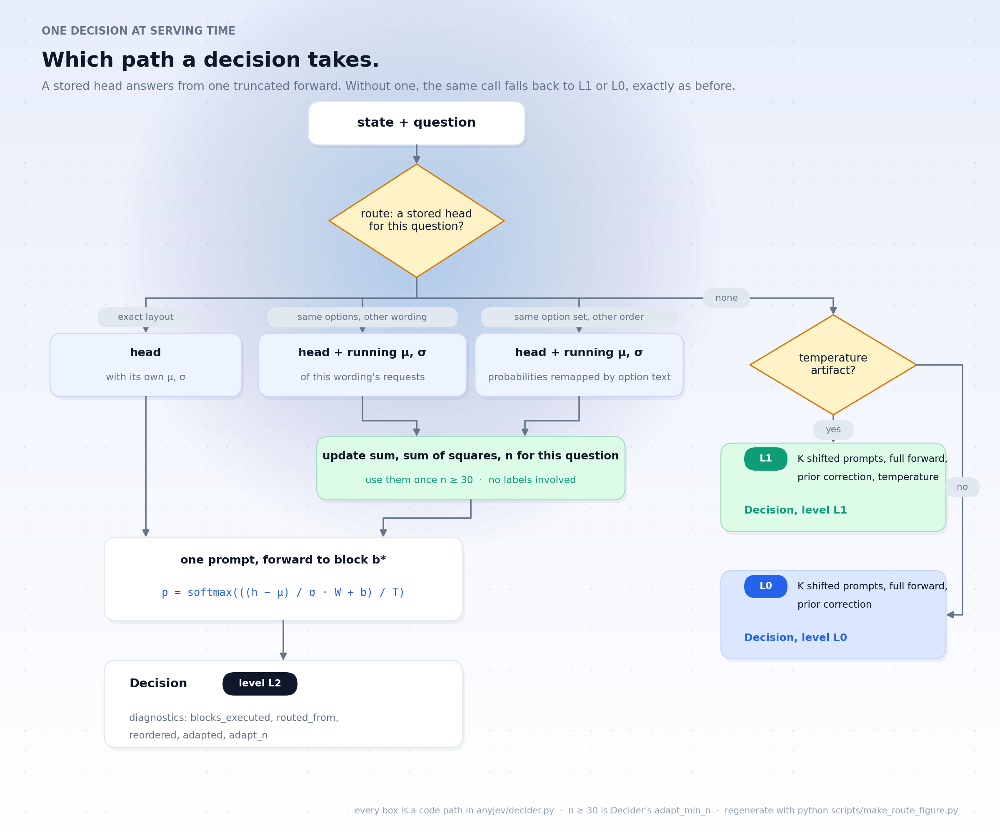
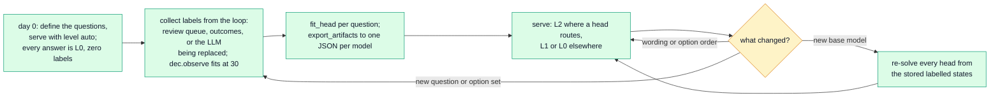

<div align="center">


[](https://pypi.org/project/anyjev/)
[](https://pypi.org/project/anyjev/)
[](https://github.com/nokia-applied-research/AnyJev/actions/workflows/ci.yml)
[](LICENSE)

[English](README.md) · **简体中文** · [🚀 用法](#-用法) · [📊 结果](#-结果) · [🧭 路线图](#-路线图) · [📖 档位约定](docs/levels.md)

</div>

<p align="center">
  <b>Jiamu Zhang</b><sup>1</sup> &nbsp;&nbsp;&nbsp; <b>Tianze Yang</b><sup>1</sup> &nbsp;&nbsp;&nbsp; <b>Yucheng Shi</b><sup>2</sup> &nbsp;&nbsp;&nbsp; <b>Liang Wu</b><sup>1</sup>
</p>
<p align="center">
  <sub><sup>1</sup>&nbsp;Nokia, Sunnyvale, CA &nbsp;&nbsp;&nbsp;&nbsp; <sup>2</sup>&nbsp;Tencent Hunyuan</sub>
</p>

<p align="center">
  
  <br>
  <sub>Qwen3-8B，一条真实的 BANKING77 样本。图中每个数字都是模型的真实输出。</sub>
</p>

> [!TIP]
> **🆕 L2 已经发布。** 每个问题一个闭式 head，100–300 条标签几秒钟解出来，**一条 prompt、前向停在模型约三分之二深度处**作答；问法换了也不用新标签，它自己跟得上。[直接看 ↓](#-一个自己维护自己的-head)

## ✨ 它做什么

向任意开源 LLM 提一个**类型化的问题**，拿回一个**决策和一个可以拿来设阈值的概率**，直接从一次 prefill 的 next-token 分布上读出来。不生成 token、不用解析、不用微调。直接读 logits 时，换个选项顺序答案就会变，置信度也不可信；AnyJev 用零标签修好前者，用几百条标签修好后者。

<div align="center">

| | ⚪&nbsp;直接读&nbsp;logits<br><sub>一个 prompt</sub> | 🔵&nbsp;**AnyJev&nbsp;L0**<br><sub>零标签</sub> | 🟢&nbsp;**AnyJev&nbsp;L1**<br><sub>+ 温度缩放</sub> |
|:--|:--:|:--:|:--:|
| 需要标签 | 无 | **无** | 100–500 条 |
| 选项倒序后答案改变的比例 | 0.230 | **0.073** | 0.077 |
| 准确率 | 0.747 | **0.803** | 0.807 |
| 校准误差（ECE） | 0.240 | 0.184 | **0.095** |
| **错误率 ≤5% 时可自动决策的比例** | **7.7%** | **46.3%** | **52.0%** |

<sub>Qwen3-8B，BANKING77 20 分类，300 条测试样本。含全部消融行的完整表：<a href="docs/results_bench.md">docs/results_bench.md</a></sub>

</div>

最后一行才是重点。准确率只动了 6 个点，但可以安全自动化的流量从 **7.7% 涨到 52.0%**，在这个任务上相差 6.8 倍（n=300 的点估计，区间很宽，见"局限"）。直接读 logits 时那个 "0.9" 不足以支撑你去行动，于是所有请求都得转人工；一旦概率真的表示它字面的意思，你才能设阈值。

## 🚀 用法

**📦 1. 安装**

```bash
pip install "anyjev[hf]"
```

**💬 2. 提类型化的问题。** L0 默认开启，不需要标签。

```python
from anyjev import Decider, Question
from anyjev.backends.hf import HFBackend

d = Decider(HFBackend("Qwen/Qwen3-8B"))

route = Question.choice("Which team should handle this?", ["billing", "technical", "sales", "other"], name="route")
risky = Question.noul("Is this tool call destructive or irreversible?", name="risky")
done  = Question.score("How complete is the task?", bins=5, name="done")

r = d.decide({"conversation": [...], "tool_call": {...}}, [route, risky, done])
r["route"].distribution    # {"billing": 0.81, "technical": 0.07, ...}
r["risky"].p_true          # 0.12
r["done"].value            # 0.35
r.level                    # "L0"
```

**🎯 3. 有标签就加上。** 温度缩放是 L1；闭式 head 是 **L2**，准确率最高的那一档。

```python
d.calibrate(risky, states, labels)          # 100–500 条标签 → L1（一个温度）
d.fit_head(route, states, labels)           # 100–300 条标签 → L2，一次前向 + 一次闭式求解，几秒钟
d.save_artifacts("qwen3-8b.json")           # 下次 d.load_artifacts(...)；每个 head 约 100 KB

r = d.decide(state, [route], level="auto")  # 能路由到 head 就 L2，否则 L1，再否则 L0
r["route"].level                            # "L2"
```

**🔁 4. 也可以让业务循环来喂。** `d.observe(route, state, label)` 把陆续到达的标签存下来，攒到 30 条自动解出 head，之后在 60、120…… 条时自动重解。

**⚡ 部署。** 目前所有档位都通过 transformers 后端（`anyjev.backends.hf`）提供；vLLM / SGLang 的部署在[路线图](#-路线图)上，不在这个版本里。多个 state、同一个问题用 `d.decide_batch(states, question)`。

**🎬 一条命令试一下。** `python -m demo.jev_mode --backend fake` 在合成模型上一秒内跑完整套流程，无需下载；加 `--lifecycle` 演示部署循环；去掉 `--backend fake` 就是真实 Qwen3 加随包发布的 head（见 [demo](demo/)）。

## 🧠 工作原理

<p align="center">
  
</p>

| 档位 | 需要 | 做什么 | **不**做什么 |
|---|---|---|---|
| `raw` | 无 | 在标签 token 上做受限 softmax（各家克隆版的做法） | 任何关于偏置和校准的事 |
| `L0` | 无 | 在 K 种循环移位上把位置偏置平均掉，并除掉标签先验 | 让模型的不确定性变得校准 |
| `L1` | 每题 100–500 条标签 | 在 L0 之上做温度缩放 | 改变排序 |
| **`L2`** | **每题 100–300 条标签，本地模型** | **在约 ⅔ 深度的 hidden state 上解一个闭式 head（收缩 LDA / ridge），每个 state 一条 prompt** | **迁移到另一个问题或另一个模型** |

每个 `Decision` 都带着自己的 `level`，下游代码可以拒绝在错误的档位上行动。K 选一的 `choice` 在 L0 下要 K 次 prefill（单张 H100、batch 32、K=20 时约 0.25 秒一条）；**L2 比一次完整前向还便宜**——一条 prompt，提前停：Qwen3-8B 上是 0.68×。

## <a id="-一个自己维护自己的-head"></a>🔁 一个自己维护自己的 head

L2 不是一次训练。标签换来的是**一次闭式求解**（CPU 上几秒钟，没有梯度，模型权重一个字节都不动）。之后变的只有 head 的特征均值和尺度，而且是从**无标签**流量里重估出来的——所以问法或选项顺序变了，head 自己跟得上；只有出现新问题时才需要新标签。

<p align="center">
  
</p>

换个问法之后，Qwen3-8B 的 head 直接拿去用会从 0.77 掉到 0.65–0.70；用新问法下的 **30 条无标签请求**重估一下均值和尺度就回到 0.74–0.75，而重新标注再拟合是 0.77（[JSON](bench/results_paraphrase/2026-09-22/)）。

**服务时的一次决策。** 有存好的 head 就从一次截断前向直接作答；没有的话，同一个调用照旧回落到 L1 或 L0。路由逻辑见 [docs/method_v3.md](docs/method_v3.md)。

<p align="center">
  
</p>

**部署生命周期：第 0 天从 L0 起步，标签从业务循环里来，head 几秒钟解出来**



**state** 本身的分布漂移（而不是问法变了）是重估看不见的，所以定期在一小批带标签样本上抽查仍然留在流程里。完整方法：[docs/method_v3.md](docs/method_v3.md)。


## 📊 结果

<table>
<tr>
<td align="center" width="33%" valign="top">
<h3>9 / 9</h3>
<b>🔁 顺序翻转全部下降</b><br>
<sub>每一个模型 × 任务的行，L0，零标签</sub><br>
<sub><a href="docs/results_bench.md">3 模型 × 3 任务 →</a></sub>
</td>
<td align="center" width="33%" valign="top">
<h3>0.80</h3>
<b>🧩 typed-decisions 准确率</b><br>
<sub>Qwen3-32B 与 30B-A3B 的 L2，每题 300 条标签；Jev 官方公布 0.727，微调后的 Laya 0.768</sub><br>
<sub><a href="docs/results_exit.md">5 个模型 →</a></sub>
</td>
<td align="center" width="33%" valign="top">
<h3>0.68×</h3>
<b>⚡ 一条决策的成本</b><br>
<sub>相对一次完整前向，Qwen3-8B 的 L2：一条 prompt，停在 36 块中的第 24 块</sub><br>
<sub><a href="docs/results_latency.md">延迟 →</a></sub>
</td>
</tr>
</table>

**Jev 模式**，在 LocalLLaMA/typed-decisions 上（20 个问题、每题 300 条标签、2000 条留出决策）：

<div align="center">

| 模型 | L0，零标签 | **L2** | block | 相对一次前向的成本 |
|:--|:--:|:--:|:--:|:--:|
| Qwen3-1.7B | 0.494 | **0.730** | 18 / 28 | 0.70× |
| Qwen3-4B | 0.564 | **0.786** | 24 / 36 | 0.69× |
| Qwen3-8B | 0.647 | **0.771** | 24 / 36 | 0.68× |
| Qwen3-30B-A3B | 0.630 | **0.799** | 40 / 48 | 未测 |
| Qwen3-32B | 0.700 | **0.798** | 52 / 64 | 0.84× |

<sub>L2 的 pooled ECE 都在 0.03–0.05。同一个集合上，Jev 0.727、微调后的 Laya 0.768，均为其作者公布的数字。每一个单元格：<a href="docs/results_exit.md">docs/results_exit.md</a></sub>

</div>

1.7B 在 64% 深度处就达到了 Jev 公布的数字；4B 与微调后的 421M Laya 打平。**100 条标签**就能让 8B 的 head 到 0.740（20 条：0.654，300 条：0.772）。

<p align="center"><sub>更多：<a href="docs/jev_mode.md">完整的 Jev 模式</a> · <a href="demo/games/README.md">2048 与扫雷</a> · <a href="docs/results_maze.md">NanoJev 迷宫</a> · <a href="docs/when_l0_helps.md">L0 什么时候有用</a> · <a href="docs/results_small_models.md">小模型</a> · <a href="docs/research_log.md">研究日志，含负结果</a></sub></p>

<details>
<summary>随包发布的 head，以及一个 head 的代价</summary>

`anyjev-heads/<model>.json` 为 Qwen3-1.7B / 4B / 8B / 30B-A3B / 32B 各提供 23 个 head（20 个 typed-decisions 问题加三个 bench 任务），都是走用户同样的 `fit_head` → `decide_batch` 路径构建并验证的（`scripts/build_heads.py`）。一个 head 就是一个 `[hidden, K]` 矩阵加偏置、标准化向量和温度：约 100 KB，在 1.7B–8B 上 2–8 秒解出来。

大模型的 head 也能无梯度地蒸馏进小模型：用 32B 的 head 给每个 workflow 1200 条生成的 case 打标签，1.7B 从 0.730 提到 0.760（4B 和 8B 不动）。见 [docs/jev_mode.md](docs/jev_mode.md)。

</details>

<details>
<summary>所有模型和任务汇总成一张图</summary>


</details>

<sub>每个数字都由提交进仓库的 JSON 重新生成（`bash scripts/regen_docs.sh`）；从干净检出重跑一遍，所有零标签数字逐位一致。与 TypeSafe AI 和 Jev 无任何关联；标注为其作者公布的那些行，我们没有重跑。</sub>

## 🧭 路线图

- [x] `choice`、`noul`、`score`，一次 prefill，不生成任何 token
- [x] 零标签的 L0；L1 artifact 存成 JSON；`require=` 强制档位
- [x] **L2**：每题一个闭式 head，路由、无标签自适应、`level="auto"`、`observe`
- [x] 五个 Qwen3 模型的随包 head；打包好的 demo（`python -m demo.jev_mode`）
- [ ] **在推理引擎上跑 L2**（vLLM / SGLang）：取某一层的残差流，或导出截断后的 checkpoint
- [ ] **真实 agent 循环里的评测**：同样的决策放进 agent 里，和它要替换掉的那个 LLM 对比
- [ ] head 上 Hugging Face Hub、一个可交互的 Space、一份技术报告
- [ ] 更多模型（Llama、Gemma、Mistral、DeepSeek）、超过 26 个选项的 span 读法、conformal 弃答

带日期的计划和"help wanted"清单：[ROADMAP.md](ROADMAP.md)。

## 🔍 局限

- **在 typed-decisions 上，"准确率"衡量的是与一个教师 LLM 的一致性。** gold 是同一个模型三次采样的均值；该教师的一次新采样与它只有 0.735 的一致率。
- **L2 是按问题、按模型的。** 在别的问题上拟合的 head 对新问题没有帮助，而且目前只发布了 Qwen3 的 head。它还需要 hidden state：今天只支持 transformers；vLLM / SGLang 在路线图上。
- **校准救不了答不出来的模型。** 在迷宫边和扫雷上，没有任何读法能赢过平凡基线。
- **L0 并非处处白赚。** 当某一个标签占绝对多数时，batch prior 会损失准确率（见 [L0 什么时候有用](docs/when_l0_helps.md)）。

<sub>此外：字母读法最多 26 个选项（span 读法在路线图上，代码里还没有）；5% 风险下的覆盖率在 n=300 时方差很大；头部表格都是 Qwen 模型；这里每条决策都是孤立评测的，不是在 agent 循环里。</sub>

## 🤝 参与和引用

后端和 bench provider 都是一个文件一个，其中几个标了 **help wanted**（[ROADMAP.md](ROADMAP.md)、[CONTRIBUTING.md](CONTRIBUTING.md)）。变更记录：[CHANGELOG.md](CHANGELOG.md)。致谢：[CREDITS.md](CREDITS.md)。

```bibtex
@software{anyjev2026,
  title  = {AnyJev: Turn any LLM into a Jev-style decision model},
  author = {Zhang, Jiamu and Yang, Tianze and Shi, Yucheng and Wu, Liang},
  year   = {2026},
  url    = {https://github.com/nokia-applied-research/AnyJev}
}
```

Apache-2.0，见 [LICENSE](LICENSE)。数据集各自保留其许可证，见 [THIRD_PARTY.md](THIRD_PARTY.md)。
