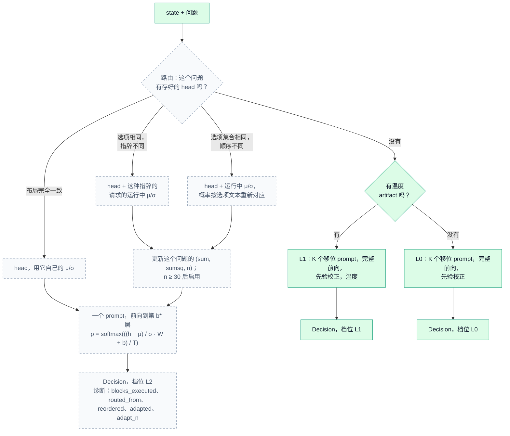
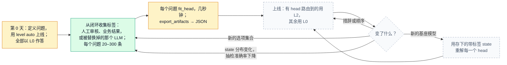

<div align="center">


[](https://pypi.org/project/anyjev/)
[](https://pypi.org/project/anyjev/)
[](https://github.com/nokia-applied-research/AnyJev/actions/workflows/ci.yml)
[](LICENSE)

[English](README.md) · **简体中文** · [🚀 用法](#-用法) · [📊 结果](#-结果) · [🧭 路线图](#-路线图) · [📖 档位约定](docs/levels.md)

</div>

<p align="center">
  <b>Jiamu Zhang</b><sup>1</sup> &nbsp;&nbsp;&nbsp; <b>Tianze Yang</b><sup>1</sup> &nbsp;&nbsp;&nbsp; <b>Yucheng Shi</b><sup>2</sup> &nbsp;&nbsp;&nbsp; <b>Liang Wu</b><sup>1</sup>
</p>
<p align="center">
  <sub><sup>1</sup>&nbsp;Nokia, Sunnyvale, CA &nbsp;&nbsp;&nbsp;&nbsp; <sup>2</sup>&nbsp;Tencent Hunyuan</sub>
</p>

<p align="center">
  
  <br>
  <sub>Qwen3-8B，一条真实的 BANKING77 样本。图中每个数字都是模型的真实输出。</sub>
</p>

> [!TIP]
> **🚧 未完待续：** L2，为每个问题挂一个闭式 head，一个 prompt 作答。见[路线图](#-路线图)。

## ✨ 它做什么

向任意开源 LLM 提一个**类型化的问题**，拿回一个**决策和一个可以拿来设阈值的概率**，直接从一次 prefill 的 next-token 分布上读出来。不生成 token、不用解析、不用训练。直接读 logits 时，换个选项顺序答案就会变，置信度也不可信；AnyJev 不用任何标签就能把这两个问题都修好。

<div align="center">

| | 直接读 logits | **AnyJev L0** | **AnyJev L1** |
|:--|:--:|:--:|:--:|
| 需要标签 | 无 | **无** | 100–500 条 |
| 选项倒序后答案改变的比例 | 0.230 | **0.073** | 0.077 |
| 准确率 | 0.747 | **0.803** | 0.807 |
| 校准误差（ECE） | 0.240 | 0.184 | **0.095** |
| **错误率 ≤5% 时可自动决策的比例** | **7.7%** | **46.3%** | **52.0%** |

<sub>Qwen3-8B，BANKING77 20 分类，300 条测试样本。含全部消融行的完整表：<a href="docs/results_bench.md">docs/results_bench.md</a></sub>

</div>

最后一行才是重点。准确率只动了 6 个点，但可以安全自动化的流量从 **7.7% 涨到 52.0%**，在这个任务上相差 6.8 倍（n=300 的点估计，区间很宽，见"局限"）。直接读 logits 时那个 "0.9" 不足以支撑你去行动，于是所有请求都得转人工；一旦概率真的表示它字面的意思，你才能设阈值。

## 🚀 用法

**📦 1. 安装**

```bash
pip install "anyjev[hf]"
```

**💬 2. 提类型化的问题。** 默认就是 L0，不需要标签。

```python
from anyjev import Decider, Question
from anyjev.backends.hf import HFBackend

d = Decider(HFBackend("Qwen/Qwen3-8B"))

route = Question.choice("这个请求该交给哪个团队？", ["billing", "technical", "sales", "other"], name="route")
risky = Question.noul("这个工具调用是否具有破坏性或不可逆？", name="risky")
done  = Question.score("任务完成度是多少？", bins=5, name="done")

r = d.decide({"conversation": [...], "tool_call": {...}}, [route, risky, done])
r["route"].distribution    # {"billing": 0.81, "technical": 0.07, ...}
r["risky"].p_true          # 0.12
r["done"].value            # 0.35
r.level                    # "L0"
```

**🎯 3. 有标签时再校准。** 每个问题 100–500 条带标签的 state，就能用上 L1。

```python
d.calibrate(risky, states, labels)          # labels 是选项下标（noul：0 = Yes）
d.save_artifacts("qwen3-8b.json")           # 下次用 d.load_artifacts("qwen3-8b.json") 加载
r = d.decide(state, [risky], level="L1", require="L1")   # 达不到 L1 直接报错，不会悄悄退回 L0
```

**⚡ 用 vLLM 部署。** 先运行 `vllm serve Qwen/Qwen3-8B --enable-prefix-caching`，再用 `anyjev.backends.vllm` 里的 `Decider(VLLMBackend("http://localhost:8000", "Qwen/Qwen3-8B"))`。同一个问题问很多 state 时，用 `d.decide_batch(states, question)`。

## 🧠 工作原理

<p align="center">
  
</p>

| 档位 | 需要什么 | 做什么 | **不**做什么 |
|---|---|---|---|
| `raw` | 无 | 在标签 token 上做受限 softmax（各个克隆项目的做法） | 任何关于偏差或校准的事 |
| `L0` | 无 | 消除位置偏差和标签先验偏差 | 让模型自身的不确定性变得校准 |
| `L1` | 每个问题 100 到 500 条标签 | 在 L0 之上做温度缩放 | 在校准集之外的分布偏移下仍然可靠 |

每个 `Decision` 都带着自己的 `level`。K 个选项的 `choice` 在 L0 下需要 K 次 prefill，共享前缀、可以 batch：一张 H100 上 K = 20、batch 32 时约每个决策 0.25 秒。

## 📊 结果

<table>
<tr>
<td align="center" width="33%" valign="top">
<h3>9 / 9</h3>
<b>🔁 选项翻转全部下降</b><br>
<sub>每个模型 × 任务组合，L0</sub><br>
<sub><a href="docs/results_bench.md">3 个模型 × 3 个任务 →</a></sub>
</td>
<td align="center" width="33%" valign="top">
<h3>0.036</h3>
<b>🎯 typed-decisions 的 ECE</b><br>
<sub>Qwen3-32B + L1，零训练；Jev（官方公布）0.144。看准确率的话，微调后的 Laya 仍然领先。</sub><br>
<sub><a href="docs/results_typed.md">2,000 个决策 →</a></sub>
</td>
<td align="center" width="33%" valign="top">
<h3>0.771</h3>
<b>🧩 闭式 head 准确率</b><br>
<sub>每题 200 个标签；raw 0.626</sub><br>
<sub><a href="bench/results_heads">预览 →</a></sub>
</td>
</tr>
</table>

<p align="center"><sub>更多：<a href="docs/results_latency.md">延迟</a> · <a href="demo/games/README.md">2048 与扫雷</a> · <a href="docs/results_maze.md">NanoJev 迷宫</a> · <a href="docs/when_l0_helps.md">L0 什么时候有用</a> · <a href="docs/results_small_models.md">小型模型</a> · <a href="docs/results_bench.md">全部消融</a></sub></p>

<details>
<summary>闭式 head：数字与注意事项</summary>

| typed-decisions，Qwen3-8B，每题 200 个标签，20 题 × 100 条测试 | acc | ECE | Brier |
|---|---|---|---|
| raw logits | 0.626 | 0.330 | 0.688 |
| AnyJev L0（排列） | 0.635 | 0.320 | 0.669 |
| AnyJev L1（温度） | 0.626 | 0.174 | 0.482 |
| **闭式 head，每题按交叉验证选** | **0.771** | **0.120** | **0.339** |
| laya-typed-decisions，用全部 300 条训练样本微调 | 0.768 | 0.215 | — |

分类型：`choice` 0.60 → 0.75，`noul` 0.71 → 0.85，`score` 0.59 → 0.73；20 题里 19 题变好。在单一选项顺序上拟合的 head 不具备顺序不变性（选项倒序后 0.95 的答案会变；改用循环移位平均的特征后降到 0.11–0.19，代价是 K 次 prefill），而且标签必须来自任务本身：用模型自己的答案拟合 head 没有收益。目前只有一个模型、一个 seed；JSON 在 `bench/results_heads/`。

</details>

<details>
<summary>所有模型和任务的汇总图</summary>


</details>

<sub>所有数字都由提交的 JSON 重新生成（`bash scripts/regen_docs.sh`）；一次独立复现在所有零标签数字上逐位一致。与 TypeSafe AI 及 Jev 无关；标注为原作者公布的行没有重跑。</sub>

## 🧭 路线图

- [x] `choice`、`noul`、`score` 一次 prefill 读出，不生成任何 token
- [x] 零标签的 L0；L1 的 artifact 存成 JSON；用 `require=` 强制档位
- [x] transformers 和 vLLM 后端，支持共享前缀打分
- [x] 离线拟合闭式 head（预览）
- [ ] **L2**：每个问题一个闭式 head，一个 prompt 作答，带路由和 `level="auto"`
- [ ] 部署指南：从闭环收集标签、重拟合、换基座模型时重解
- [ ] 超过 26 个选项的 span 读法、conformal 弃答
- [ ] Llama 和 Gemma 结果、Jev 兼容的 HTTP 服务端、多模态 state

*🚧 未完待续……* 带日期的计划见 [ROADMAP.md](ROADMAP.md)。

<details>
<summary><b>有了 L2 之后，一次决策怎么走</b> <i>（未完待续）</i></summary>

绿色已在 `main` 里，虚线未完待续。L2 上线之前，每个决策都走右边的分支。



</details>

<details>
<summary><b>部署生命周期</b> <i>（未完待续）</i></summary>

第 0 天零标签用 L0 上线，让业务闭环产生标签，几秒钟拟合 head，只有换基座模型时才需要重解。绿色已在 `main` 里，琥珀色是预览，虚线未完待续。



</details>

## 🔍 局限

- **校准救不了答不出来的模型。** 在迷宫的边判断和扫雷上，没有任何读法打过最简单的基线。
- **L0 不是处处稳赢。** 某个标签占比很高时，batch 先验会损失准确率；请在你自己的任务上测（[L0 什么时候有用](docs/when_l0_helps.md)）。
- **L1 扛不住校准集之外的分布偏移。**

<sub>另外：字母读法最多 26 个选项；L1 只重塑置信度、不改变排序；n = 300 时 5% 风险下的覆盖率是高方差的估计；主表目前都是 Qwen 模型。</sub>

## 🤝 参与贡献与引用

后端和 benchmark provider 都是一个文件一个，其中几项标了 **help wanted**（[CONTRIBUTING.md](CONTRIBUTING.md)）。改动记录：[CHANGELOG.md](CHANGELOG.md)。致谢：[CREDITS.md](CREDITS.md)。

```bibtex
@software{anyjev2026,
  title  = {AnyJev: Turn any LLM into a Jev-style decision model},
  author = {Zhang, Jiamu and Yang, Tianze and Shi, Yucheng and Wu, Liang},
  year   = {2026},
  url    = {https://github.com/nokia-applied-research/AnyJev}
}
```

Apache-2.0，见 [LICENSE](LICENSE)。数据集保留各自的许可证，见 [THIRD_PARTY.md](THIRD_PARTY.md)。
