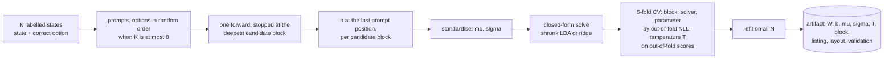
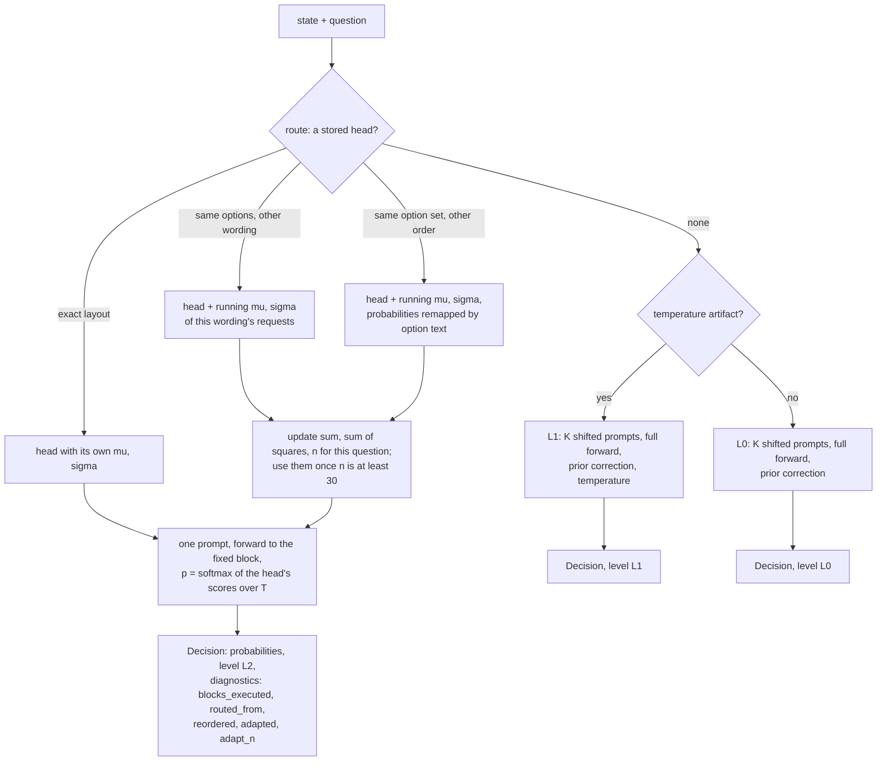
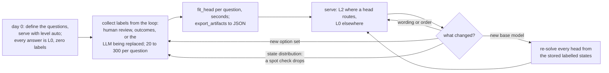

# AnyJev method, version 3: a closed-form head at a fixed depth, with routing and label-free adaptation

*State of the method on 2026-09-22. Everything below is measured; every number names the JSON it
comes from (`bench/results_*`), and `docs/research_log.md` holds the experiment-by-experiment record
(entries 0–14). This page explains the method end to end for someone who has not followed that record.*

## 0. One paragraph

AnyJev turns an open causal LLM into a Jev-style decision model (L0 / L1 are measured on 11 models
of seven architectures, L2 on five Qwen3 sizes and on the transformers backend only): a typed
question (pick one of K options, yes or no, a score) is answered with calibrated probabilities from
one prefill, no generation. Version 3 adds **L2**: instead of reading the answer off the model's own output layer,
the forward pass is stopped at a fixed block about two thirds of the way through the model, the
hidden state at the last prompt position is taken, and a small linear head solved in closed form on
100–300 labelled examples of the question turns it into probabilities. No gradient step and no
change to the model's weights; a head is a `[hidden, K]` matrix plus a few vectors, solved in
seconds on a CPU. Heads are stored per (model, question) in a JSON artifact. At inference a router
finds the head for an incoming question (exact layout, or the same options under another wording
or order), and the head's feature standardisation is re-estimated from the unlabelled requests it
serves, so a head follows its question across rewordings with no new labels. Where no head applies
the older zero-label level (L0) answers. On LocalLLaMA/typed-decisions a 1.7B model at 64% of its
depth reaches 0.730 (the number listed for Jev, not measured here: 0.727), a 4B at 67% reaches
0.786 (fine-tuned Laya, measured here: 0.768), and the 30B-class models at 81–83% reach 0.80, each
at 0.68–0.84 of the batched wall clock of one plain forward of the same model at 1000-token states
(1.00 on the 1.7B at 110 tokens, launch-bound; the 30B-A3B not measured in eager mode)
(`bench/results_exit/2026-09-22/`).

## 1. Setting and vocabulary

- **State**: whatever the decision is about (a conversation, a trace, an invoice, an alert), any
  JSON or text; rendered as text by `anyjev.state.render_state`.
- **Question** (`anyjev.Question`): `choice(text, options)`, `noul(text)` (Yes/No), or
  `score(text, bins | levels)`. A question's **layout** is (kind, wording, option texts, order); its
  hash is `q.key`.
- **Prompt**: a chat-templated message: a fixed system line ("You are a decision function ...
  Reply with the answer label only"), then `State:` + the state, `Question:` + the wording,
  `Options:` + one line per option labelled `A.`, `B.`, ... (digits for scores; `Answer Yes or No.`
  for noul), then "Answer with the letter only." The **answer position** is the last prompt token.
- **Backend**: `HFBackend` (transformers) exposes next-token log-probabilities and, for L2, hidden
  states at chosen blocks with an early-stopping block loop (`hidden_states_to(max_layer=)`,
  bit-exact against the plain forward in fp32, `scripts/exit_parity.py`). vLLM and API backends
  expose only log-probabilities and therefore stop at L1.
- **Levels** (`Decision.level`, enforceable with `require=`):

| level | needs | what it does | what it does not do |
|---|---|---|---|
| `raw` | nothing | softmax over the label tokens at the answer position | remove any bias |
| `L0` | nothing | cyclic-shift marginalisation over option positions + a label-prior correction | make probabilities calibrated |
| `L1` | 100–500 labels | a temperature on top of L0 | change the ranking |
| `L2` | 100–300 labels, a transformers backend | a closed-form head on the hidden state at a fixed block; the most accurate level on the typed questions (K <= 5) and the three bench tasks, and the cheapest per decision (one prompt per state, forward stopped at ~2/3 depth) | transfer to another question |
| `auto` (a request, not a result level) | | L2 where a head routes, else L1 where an artifact exists, else L0 | |

## 2. The L2 head

### 2.1 Feature

For a prompt of the question on a state, run blocks `1..b*` of the model (`b*` fixed per model,
section 2.4) and take the residual-stream vector at the last prompt position after block `b*`:
`h ∈ R^d` (`d` = 2048 for Qwen3-1.7B, 2560 for 4B, 4096 for 8B, 5120 for 32B). Nothing after `b*`
is computed: no later blocks, no final norm, no `lm_head`.

### 2.2 Fitting (`Decider.fit_head(question, states, labels)`)

Input: `N` states of the question and their correct option indices (`N ≥ max(8, 2K)`; in practice
100–300). Steps:

1. **Listing order.** With at most 8 options (`listing="auto"`), each calibration state is shown
   its options in a random order; labels stay option indices. The head then reads the answer
   wherever it is listed (flip under option reversal 0.07 instead of
   0.18 for a head fit on one order; `bench/results_paraphrase/2026-09-22/<model>.order.json`). With
   more than 8 options the canonical order is kept, because with 20 options and a few hundred
   states the position code becomes noise the head cannot average out (random listings cost the
   20-way bench heads 6–18 points in the artifact builds, research log entry 13).
2. **One forward** of the `N` prompts, stopped at the deepest candidate block, capturing `h` at
   every candidate block (default candidates: 50 / 60 / 70 / 85 / 100 % of depth; the shipped
   artifacts use the single block `b*` of section 2.4).
3. **Standardise**: `mu = mean(h)`, `sigma = std(h) + 1e-6` over the `N` states, feature-wise;
   `x = (h − mu) / sigma`.
4. **Solve** a linear head `s = x W + b`, `W ∈ R^{d×K}`, by one of two closed forms:
   - *shrunk LDA*: class means `m_k`; within-class residuals `R`; shrunk covariance
     `S = (1−a) RᵀR/(N−1) + a τ I` with `τ = tr(RᵀR/(N−1))/d` and `a ∈ {0.3, 0.6, 0.9}`;
     `W = S⁻¹ [m_1 … m_K]`, `b_k = −½ m_kᵀ S⁻¹ m_k + log π_k`. The inverse is taken through the
     Woodbury identity, so the linear solve is `N×N`, never `d×d`.
   - *ridge to one-hot targets*: `W = X_cᵀ (X_c X_cᵀ + λ I)⁻¹ Y_c` (dual form, `N×N`),
     `λ ∈ {0.1, 1, 10, 100}`, `b` from the means.
5. **Select** the block, the solver and its parameter by 5-fold cross-validation on the `N` states:
   for each configuration, out-of-fold scores are computed, a temperature is fit on them, and the
   configuration with the lowest out-of-fold negative log-likelihood wins. The **temperature** `T`
   kept is the one fit on the out-of-fold scores of the winner (so the head is calibrated on data it
   did not fit).
6. **Refit** the winner on all `N` states. The artifact is `(b*, kind, W, b, mu, sigma, T, listing,
   n_calib, CV numbers)` plus the question's layout.

Cost: one forward of `N` prompts plus a few seconds of CPU (`fit_seconds` 2–8 s per question on
the 1.7B–8B, prefill included; 7–27 s on the 32B; about a minute on the MoE in eager mode;
`bench/results_exit/2026-09-22/<model>.artifact.json`). Nothing in the model changes.

### 2.3 Inference (`decide(state, [q], level="L2")`)

Build the prompt in the question's own option order, run blocks `1..b*`, take `h`, and return
`p = softmax(((h − mu)/sigma) W + b) / T)`. One prompt per (state, question): no cyclic shifts, no
generation. Diagnostics carry `blocks_executed`, `readout`, `temperature`, and (section 3)
`routed_from`, `reordered`, `adapted`, `adapt_n`.

### 2.4 One block per model

The block is chosen on calibration data only (`bench.jev_mode_table`): per-question heads are fit
at every cached block, their pooled out-of-fold accuracy is plotted against depth, and `b*` is the
shallowest block within 0.5 points of the best. The curves are flat from about 60% of depth on the
1.7B/4B/8B and from 75–80% on the 30B-class models. Letting every question pick its own block by CV
lands 4–5 blocks deeper for no gain, and one block per model means every (state, question) prompt
stops at the same depth, so a state's questions batch into one call and can share the prefix KV.

| model | `b*` | depth | L2, typed | raw / L0 / L1 | batched ms per decision vs plain forward, 1000-token states (110-token) |
|---|---|---|---|---|---|
| Qwen3-1.7B | 18 of 28 | 64% | **0.730** | 0.468 / 0.494 / 0.499 | 0.70x (1.00x: launch-bound) |
| Qwen3-4B | 24 of 36 | 67% | **0.786** | 0.547 / 0.564 / 0.567 | 0.69x (0.67x) |
| Qwen3-8B | 24 of 36 | 67% | **0.771** | 0.626 / 0.647 / 0.648 | 0.68x (0.68x) |
| Qwen3-30B-A3B (MoE) | 40 of 48 | 83% | **0.799** | 0.599 / 0.630 / 0.630 | not measured (eager MoE) |
| Qwen3-32B | 52 of 64 | 81% | **0.798** | 0.684 / 0.700 / 0.699 | 0.84x (0.82x) |
| Jev (published) | | | 0.727 | | hosted, per request |
| Laya, fine-tuned (measured here) | | | 0.768 | | |

LocalLLaMA/typed-decisions, 20 questions, 300 labelled decisions per question to fit, 100 held out
per question to test (2000 pooled); pooled ECE of L2 is 0.03–0.05 (L1 0.036–0.055, L0 0.15–0.40);
bootstrap 95% CIs are about ±0.02 and every L2 cell is within its CI of the full-depth head.
JSON: `bench/results_exit/2026-09-22/<model>.{jevmode,depth,latency}.json`; the time ratios are
measured on one H100 NVL (`bench.exit_latency`) and equal the depth fraction plus launch overhead.
`docs/results_exit.md` is the generated table.

Label budget (Qwen3-8B, `Qwen__Qwen3-8B.labels.json`, block chosen among 22 / 28 / 36): 20 labels
0.654, 95% CI [0.641, 0.667] — level with L0 / L1 in the full typed run (0.647 / 0.648), so labels
start paying at about 50 → 0.707; 100 → 0.740 (against the 0.727 listed for Jev), 200 → 0.754,
300 → 0.772. Calibration needs
more labels than accuracy: pooled ECE 0.11 at 50 labels, 0.03 at 300.

### 2.5 What was tried and closed

- **A question-agnostic head** (one head for all questions, fit on other questions' option-line or
  last-position states; six functional forms, leave-one-question-out and cross-domain): every form
  scores at or below L0 on questions it never saw (best 0.580 against L0 0.635 on Qwen3-8B,
  `bench/results_universal/2026-09-22/`; entries 1, 3, 9, 11). Heads are per question.
- **Confidence-gated early exit** over heads at several depths was tried on the 8B and the 32B and
  did not beat one fixed block: on the 8B the gate lands on the fixed block 22 (0.769 at a mean of
  21.5 blocks against 0.770 at block 22), on the 32B the best pooled rule is 0.792 at 48.9 blocks
  against 0.798 at the fixed block 52 (`bench/results_exit/2026-09-22/<model>.cascade.json`; tables in
  entries 4, 10). The code was removed in version 3, the JSON kept. One fixed block per model is the
  product.
- **Distillation from a bigger model's zero-label answers**: bounded by the teacher's own accuracy
  (0.688 with 300 teacher labels against 0.726 with 100 gold labels;
  `bench/results_distill/2026-09-22/Qwen__Qwen3-8B.from.Qwen__Qwen3-32B.json`; entry 7). Labels must
  come from the task, or from a teacher that is itself good on it (section 4).
- **Self-labels** (heads fit on the model's own zero-label answers): 0.625 against raw 0.626
  (`bench/results_heads/2026-09-22/Qwen__Qwen3-8B.typed.json`; study code not shipped).

## 3. Routing and label-free adaptation

A head is fit for one layout. Version 3 makes it follow its question.

### 3.1 The artifact

`anyjev-heads/<model>.json` = `Decider.export_artifacts()`: `heads` keyed by `q.key`, each with the
head (section 2.2) and the layout it was fit on (`kind`, `text`, `options`, `listing`), plus the
model name, `n_blocks`, `hidden_size`, the candidate blocks, per-question and pooled validation
numbers, `anyjev.__version__` and the environment. Since 0.1 the same export also carries the
adaptation statistics of section 3.3 (`adaptation`: per question key, `sum` / `sumsq` / `n` of the L2
features, arrays in the compact format) and, with `export_artifacts(include_observations=True)`, the
labelled states recorded by `observe` (section 3.4). `load_artifacts` restores everything; a head is
refused on another model. Heads are independent: adding one never changes another. Size: 1.8–4.4 MB
for 23 heads with the arrays stored as base64 float32 (exact; plain lists are read as well).

### 3.2 Routing (`Decider.route(q)`)

In order:

1. the head with exactly this layout (`q.key`);
2. else a head of the same kind with the same option texts in the same order under **another
   wording** (the head is used with this wording's own adaptation statistics);
3. else, for heads fit on random listings (≤ 8 options), a head with the **same option set in
   another order**: the head's probabilities are mapped back by option text;
4. else no head: `level="L2"` raises, `level="auto"` falls back to L1 (if a temperature artifact
   exists) or L0.

A different option set (a renamed option, one more or fewer, a different K) is a different question.

### 3.3 Test-time adaptation (`Decider(adapt="routed", adapt_min_n=30)`)

Rewording a question moves its hidden states mostly by a **shift and a rescaling** of the feature
distribution: the head applied as is drops from 0.77 to 0.65–0.70 on Qwen3-8B (and changes its
answer on 18–27% of states on the 8B, 26–32% on the 4B), while re-estimating only `mu` and `sigma` on 30 states of the new
wording, **without labels**, recovers 0.74–0.75 (0.74–0.76 with 300 states) against 0.77 for a
labelled refit. The Decider therefore keeps, per asked question key, a running sum, sum of squares
and count of the L2 features of every request it serves; once `adapt_min_n` (30) states have been
seen, including the current batch, the routed head is used with `mu, sigma` from those statistics.
`adapt="routed"` (default) does this only for questions served by another layout's head; on a
head's own layout re-estimation costs about a point, so it is not applied there. `adapt=True`
applies it everywhere, `adapt=False` never.

| Qwen3-8B, block 24 (`bench/results_paraphrase/2026-09-22/Qwen__Qwen3-8B.paraphrase.b24.json`) | head as is | + 10 unlabelled | + 30 | + 300 | refit, 300 labels |
|---|---|---|---|---|---|
| question reworded (three hand-written ways, mean) | 0.682 | 0.729 | 0.745 | 0.752 | 0.770 |
| options listed in reverse, head fit on one order (`...order.json`) | 0.672 | | | 0.729 (recentred on the 100 test states) | |
| options listed in reverse, head fit on random orders | 0.760 | | | | |

Fitting one head on several wordings in advance does not substitute (0.57–0.73): the adaptation
belongs at inference, on the traffic itself.

### 3.4 What "maintains itself" means

After a head is solved, ordinary requests keep it working: a reworded question routes and is
re-centred by its first ~30 requests; a re-listed question routes directly; nothing else changes and
`W` is never touched. The statistics behind the re-centring are part of the artifact
(`export_artifacts` writes them, `load_artifacts` restores them), so a restart answers a reworded
question adapted from its first request, with the same probabilities as before.

The learning side is automatic as well. `Decider.observe(question, state, label)` records a labelled
state (from a review queue, an outcome, the LLM being replaced) and solves the question's head itself
once `fit_at=30` observations exist (never below max(8, 2K)), then re-solves it each time the count
grows by `refit_factor=2.0` (30, 60, 120, ...); it returns the artifact dict on the call that
(re)solved a head, else `None`. With `level="auto"` the question answers at L0 until the first solve
and at L2 afterwards, so nobody decides when to fit. `observations(question)` returns the recorded
(states, labels) and `export_artifacts(include_observations=True)` writes them, which is what makes a
later refit, or a move to a new base model, reproducible. Labels are still needed for a **new
question** (a new option set: 20–100 labels to start, up to 300 to raise the head) and for periodic
spot checks, because a shift in the *states* (not the wording) is not something the re-centring can
detect. Changing the base model means re-solving every head from the stored labelled states (seconds
each).

`python -m demo.jev_mode --backend fake --lifecycle` plays the whole line in a second on the
synthetic model (its numbers are planted, not measured on a model): day 0 at L0 (0.86 on 50 held-out
requests); labels arriving one at a time, head solved at the 30th (held-out 0.98 at L2, out-of-fold
0.97), re-solved at 60 and 120 (1.00); a rewording routed and served as is for 30 requests (0.47),
then recentred (1.00; the same requests without adaptation 0.85); export (13 KB: 1 head, 150
observations, the adaptation statistics of 1 question), restart, load: the first reworded request is
already adapted, its probabilities identical to floating-point precision (max |dp| under 1e-50). `--backend hf --questions <workflow.qname>` runs it on a real
model with that question's train split as the stream.

## 4. Distilling a big model's Jev mode into a small one

The teacher is our own strongest head (the 32B's, 0.795 on typed), not Jev. Two routes
(`bench.distill_heads`, entry 14):

- *Soft targets on the same 300 states* (the teacher head's out-of-fold probabilities as the
  student's ridge targets): at most +1 point; the states carry no new information.
- *Synthetic states*: Qwen3-8B writes 1200 new cases per workflow from three real exemplars each
  (`bench.synth_states`, thinking off, temperature 1.0; rejection < 1%), the teacher's shipped heads
  label them, and the student head is solved on its 300 gold labels plus the teacher-labelled
  states.

| student | gold 300 | gold 300 + 1200 teacher-labelled synthetic | synthetic only (1200) | teacher |
|---|---|---|---|---|
| Qwen3-1.7B | 0.730 | **0.760** [+0.015, +0.049] | 0.668 | 0.795 |
| Qwen3-4B | 0.786 | 0.785 | 0.716 | 0.795 |
| Qwen3-8B | 0.771 | 0.770 (soft targets 0.777) | 0.720 | 0.795 |

`bench/results_distill/2026-09-22/Qwen__Qwen3-32B.distill_heads.fit.json`. Distillation pays where
the student is weakest; the 4B and 8B are already within 1–2 points of the teacher on their own
labels. Synthetic states alone stay 6–9 points below the real ones, so the teacher supplements
labels rather than replacing them. No gradient anywhere in the pipeline.

## 5. The framework's flows

### 5.1 Offline: from labelled states to a head



### 5.2 Online: one decision



### 5.3 Deployment lifecycle



## 6. Deployment recipe

1. Write each decision of the agent loop as a `Question` with fixed options (which tool, escalate
   or not, task complete, safe or not). Generation is not replaced, only decisions.
2. Serve `Decider(HFBackend(model), level="auto")` from day 0: with no labels every question
   answers at L0. Qwen3-4B is the accuracy-per-cost point (0.786); 1.7B the cheapest (0.730, 0.760
   distilled); a 30B-class model the most accurate (0.80).
3. Feed the loop's labels back as they arrive: `dec.observe(q, state, label)` for every request whose
   correct option comes back later (a human review queue, an outcome, the decision of the LLM being
   replaced; then the small model reproduces that LLM's judgement at a fraction of its cost and will
   not exceed it). At 30 observations the decider solves the head itself and the question moves from
   L0 to L2; it re-solves at 60, 120, ... On Qwen3-8B, 20 labels give 0.654 (L0: 0.647), 50 give
   0.707, 100 give 0.740 (Jev's published 0.727), 300 give 0.772. (`fit_head(q, states, labels)` is
   the same solve on a list you collected yourself.)
4. `export_artifacts(include_observations=True)` into one JSON per model, ship it with the service;
   `load_artifacts` at start. The file carries the heads, the adaptation statistics of every routed
   question and the observations, so a restart answers as before and a later refit reuses the labels.
5. Cost per decision: 0.68–0.84 of one prefill of the model at `b*` at 1000-token states (1.00 on
   the 1.7B at 110 tokens, launch-bound; the 30B-A3B not measured in eager mode), one prompt per
   (state, question), no generation; Qwen3-4B at block 24: 5 ms per 110-token state batched, 30 ms per
   1000-token state, one H100 (`Qwen__Qwen3-4B.latency.json`). The model must be hosted with the
   transformers backend (hidden states); vLLM/API deployments stop at L1 until the coupling on the
   roadmap lands.
6. Keep `require="L2"` on code paths where an L0 probability would be a bug; log the diagnostics;
   spot-check a held-out labelled slice periodically.

## 7. Limits, stated

- Zero-label accuracy is L0's: 0.63–0.70 on typed for the 8B–32B (the 30B-A3B is 0.630), below
  Jev's published 0.727. L2 needs labels; nothing gradient-free we tried gives a new question a
  head without them.
- A head does not transfer to a different question (different options); wording and order are
  handled, semantics is not.
- L2 needs hidden states: the transformers backend only. Latency of the MoE in eager mode is not
  representative of its active parameters.
- The typed-decisions gold is one teacher model's soft label per decision
  (`bench/tasks/typed_decisions.py`), so a score on that set measures agreement with the teacher,
  not correctness, and a score well above the teacher's own consistency measures its quirks as much
  as the task. Over the 2,000 decisions the gold option carries a mean teacher probability of 0.66,
  and only 2 of the 2,000 gold distributions put all their mass on one option (`gold_probs` in
  `bench/results_typed_dump/2026-09-21/<model>.items.json.gz`). The three bench tasks carry their
  own datasets' labels.
- Choice questions are limited to 26 options by the letter readout.

## 8. Reproduce

```
python -m bench.extract_pools --model Qwen/Qwen3-4B --layers 12,14,16,18,20,22,24,26,28,30,32,34,36 \
    --out bench/results_exit                                            # block-loop caches (GPU, once)
python -m bench.exit_study --model Qwen/Qwen3-4B --n-layers 36          # accuracy vs depth
python -m bench.jev_mode_table --model Qwen/Qwen3-4B --n-layers 36      # b* on calibration data
python -m bench.exit_latency --model Qwen/Qwen3-4B                      # ms per decision by depth
python scripts/build_heads.py --model Qwen/Qwen3-4B --layers 24 --bench-tasks banking20,newsgroups,injection
python -m bench.paraphrase_study extract --model Qwen/Qwen3-4B && python -m bench.paraphrase_study fit --model Qwen/Qwen3-4B --block 24
python -m bench.paraphrase_study order --model Qwen/Qwen3-4B --block 24 --n-layers 36
python -m bench.synth_states --model Qwen/Qwen3-8B --per-workflow 1200
python -m bench.distill_heads label --teacher Qwen/Qwen3-32B && python -m bench.distill_heads extract --student Qwen/Qwen3-1.7B --block 18 && python -m bench.distill_heads fit
python -m bench.exit_table --date 2026-09-22 > docs/results_exit.md   # every table above, from JSON
```

Other models: the block lists per model are in the docstring of `bench/extract_pools.py`.

## Appendix: the API in a dozen lines

```python
from anyjev import Decider, Question
from anyjev.backends.hf import HFBackend

dec = Decider(HFBackend("Qwen/Qwen3-4B"), level="auto")      # adapt="routed", adapt_min_n=30 by default
dec.load_artifacts("anyjev-heads/Qwen__Qwen3-4B.json")        # shipped heads (23 questions)

q = Question.choice("What should the assistant do next?", ["answer", "escalate", "refund", "ask"], name="next")
r = dec.decide(state, [q])["next"]                            # no head yet: level L0
art = dec.observe(q, state, label)                            # None until 30 labelled states; then the head, solved in seconds
r = dec.decide(state, [q])["next"]                            # level L2, forward stopped at block 24
r.probs, r.argmax, r.level, r.diagnostics["blocks_executed"], r.diagnostics["adapted"]
art = dec.fit_head(q, states, labels)                         # or 100-300 labelled states at once
json.dump(dec.export_artifacts(include_observations=True), open("my-heads.json", "w"))  # heads, adaptation statistics, observations
```
